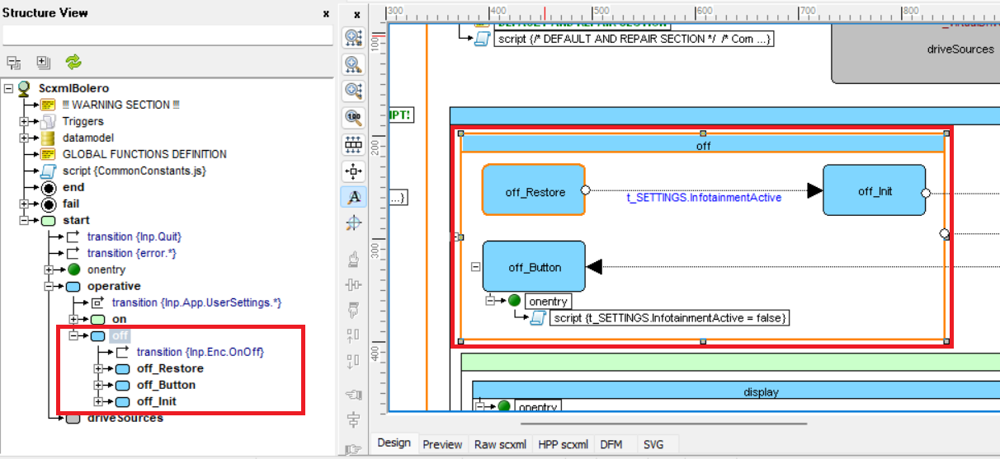
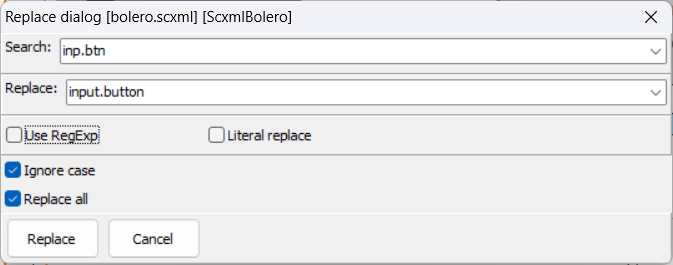
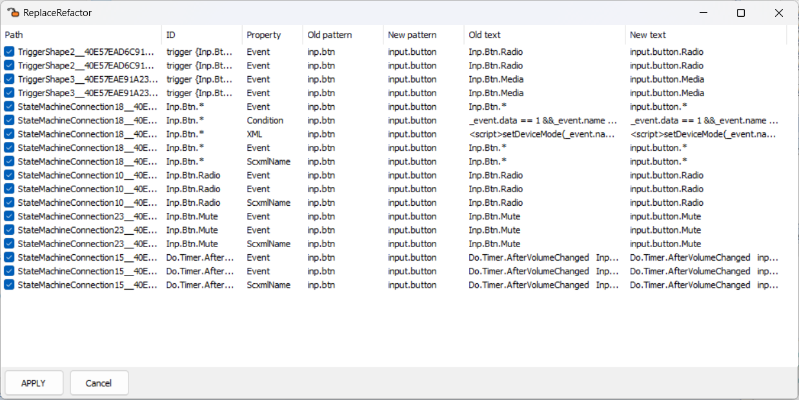
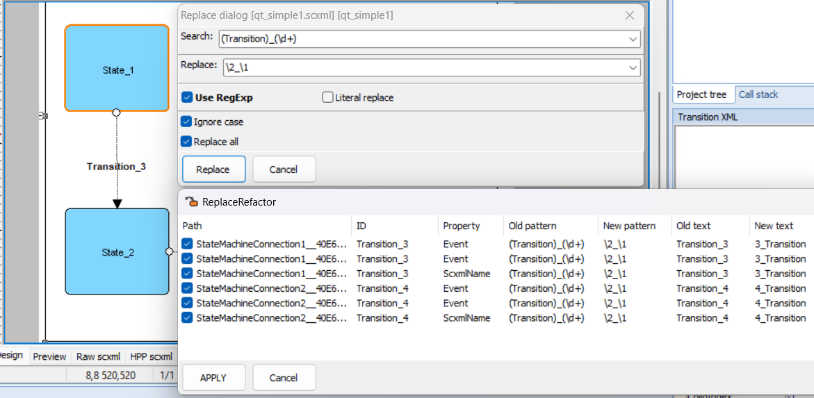

<a name="top-anchor"/>

| [Contents](../README.md#table-of-contents) | [SCXML Wiki](https://alexzhornyak.github.io/SCXML-tutorial/) | [Forum](https://github.com/alexzhornyak/ScxmlEditor-Tutorial/discussions) |
|---|---|---|

# Chart Design Panel

## Replace
Replace is performed in scope of selected shape

1. Select shape in the chart hierarchy from which to start replace
> NOTE: if you want to replace text in all chart, select root shape

2. Press `Ctrl+R`

3. Fill fields in replace dialog and press `Replace` button

4. Select items that must be replaced and press `Reply` button

### Regex Replace Example
Replace dialog has an option to switch replace with usage of regular expressions. In given example all transitions with the names `Transition_3`, `Transition_4` are swapped with regex groups to `3_Transition`, `4_Transition`, etc.

| [TOP](#top-anchor) | [Contents](../README.md#table-of-contents) | [SCXML Wiki](https://alexzhornyak.github.io/SCXML-tutorial/) | [Forum](https://github.com/alexzhornyak/ScxmlEditor-Tutorial/discussions) |
|---|---|---|---|