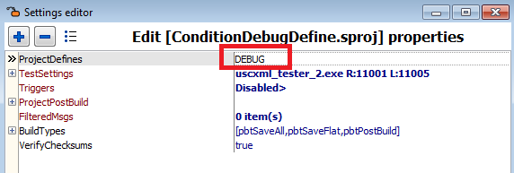
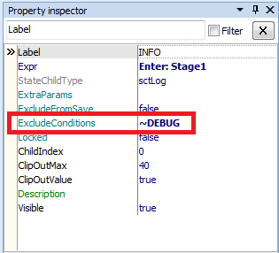
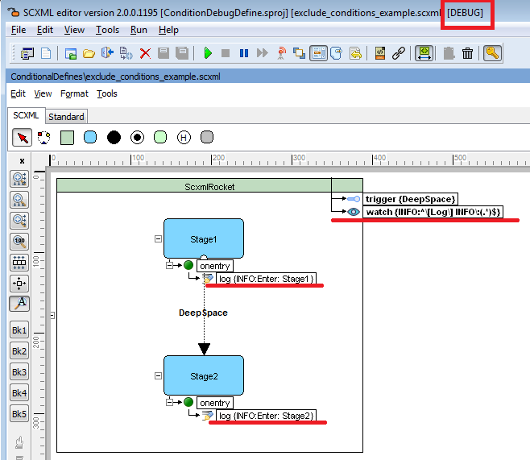
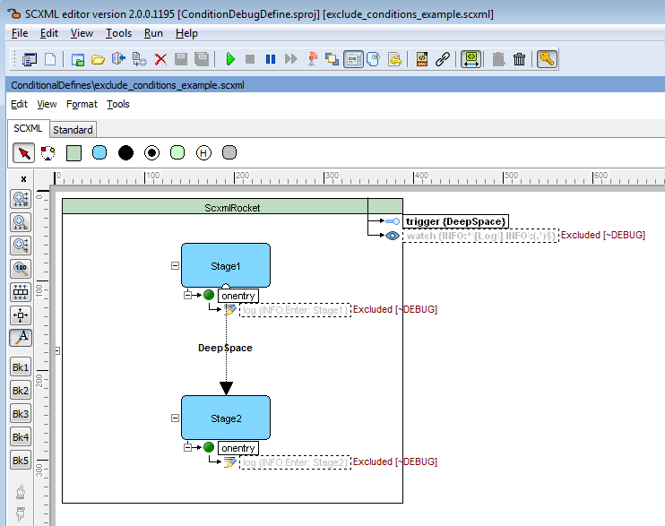

# Conditional Project Definitions
State Chart elements are able to be excluded from saving by keyword which is defined in project options.

## 'ExcludeConditions' attribute
It is a semicolon-separated list of project definitions.
If the **'ExcludeConditions'** value matches the **'ProjectDefines'** value then the element is excluded from save. This attribute supports inversion also.
You may use **'~'** sign for **inversion**.

## [Example:](../Examples/ConditionDebugDefine.sproj)

**ProjectDefines == DEBUG**

     ExcludeConditions == DEBUG -> Element is excluded
     
     ExcludeConditions == ~DEBUG -> Element is not excluded for 'DEBUG' definition,
         but is excluded for any other project value

**Project definitions will be displayed at the right side of the application's caption.**

**Excluded chart elements will be marked with the corresponding message**

