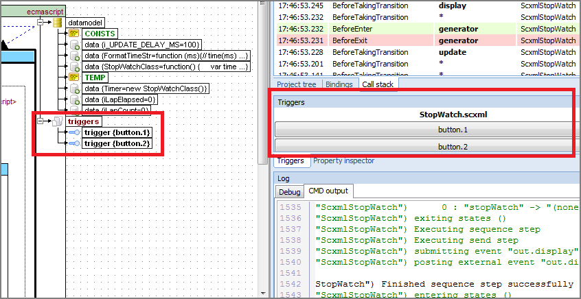
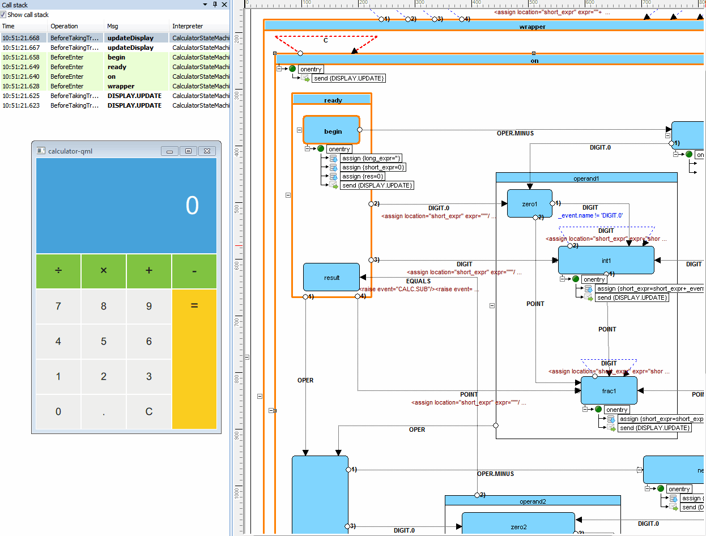

<a name="top-anchor"/>

| [Contents](../README.md#table-of-contents) | [SCXML Wiki](https://alexzhornyak.github.io/SCXML-tutorial/) | [Forum](https://github.com/alexzhornyak/ScxmlEditor-Tutorial/discussions) |
|---|---|---|

# How to debug [SCXML statecharts](https://alexzhornyak.github.io/SCXML-tutorial/)
**[ScxmlEditor](../README.md)** has an ability to execute [SCXML statecharts](https://alexzhornyak.github.io/SCXML-tutorial/) via testing applications or to listen external UDP commands such as state enter or exit, etc.

### Local debugging
ScxmlEditor starts a testing application, intercepts its command line output, receives UDP commands and sends events as UDP packages to testing application

There are two ready-to-use testing applications:

1. Based on [USCXML framework](https://github.com/tklab-tud/uscxml).
Supports **null, lua, ecmascript(since 2.1.5.1507)** datamodels

2. Based on [Qt SCXML framework](https://doc.qt.io/qt-5/qtscxml-index.html)
Supports **null, ecmascript** datamodels

Also you may write your own testing application using the corresponding API

### Receive API:
- `@@@` - clear highlighted states in all statecharts
- `@@@ScxmlName` - clear highlighted states in statechart where [\<scxml\>](https://alexzhornyak.github.io/SCXML-tutorial/Doc/scxml.html) 'name' is equal `ScxmlName` 
- `ID@ScxmlName@Msg` - commands to highlight state or display message in **CallStack** panel <br/>
**Description:**
  `ID` - integer type of command: `1 - AfterEnter, 2 - BeforeEnter, 3 - AfterExit, 4 - BeforeExit, 5 - Step, 6 - BeforeExecContent, 7 - AfterExecContent, 8 - BeforeInvoke, 9 - AfterInvoke, 10 - BeforeUnInvoke, 11 - AfterUnInvoke, 12 - BeforeTakingTransition, 13 - AfterTakingTransition, 14 - StableConfiguration, 15 - BeforeProcessingEvent` <br/>
  `ScxmlName` - name of [\<scxml\>](https://alexzhornyak.github.io/SCXML-tutorial/Doc/scxml.html) <br/>
  `Msg` - message which depends on type of command. For example: for **BeforeEnter** or **BeforeExit** - it is the id(name) of states, for **BeforeInvoke** or **BeforeUnInvoke** it is the name of invoked element, etc. </br>
> **BeforeEnter** graphically highlight and **BeforeExit** unhighlight the corresponding states, other commands are displayed in **CallStack** panel
#### Example of commands:
- `2@CalculatorStateMachine@operand1` - highlight state **operand1** in statechart **CalculatorStateMachine** <br/>
- `4@CalculatorStateMachine@operand1` - unhighlight state **operand1** in statechart **CalculatorStateMachine** <br/>
You can also trace the execution of the chart and use breakpoints.

### Send API:
It is similar to [SCXML send events logic](https://alexzhornyak.github.io/SCXML-tutorial/Doc/send.html)

#### Testing application receives events as UDP string packages in the next format:
- `%EVENT_NAME%` - valid event name
- `%PARAM_NAME%` - valid param name
- `%DATA_TYPE%` - `0-Default`(Variant type), `1-Bool`, `2-Integer`, `3-Double`, `4-String`
- `%CONTENT_DATA%`,`%PARAM_DATA%` - event data depending on `%DATA_TYPE%`
#### Option 1. With single content expression
```xml
<EVENT name="%EVENT_NAME%" >
	<content type="%DATA_TYPE%" >
		%CONTENT_DATA%
	</content>
</EVENT>
```
#### Option 2. With multiple params
```xml
<EVENT name="%EVENT_NAME%" >
	<param name="%PARAM_NAME%" type="%DATA_TYPE%" expr="%PARAM_DATA%">
	<param name="%PARAM_NAME%" type="%DATA_TYPE%" expr="%PARAM_DATA%">
</EVENT>
```

### Triggers
- #### May be assigned as `trigger shapes` in statechart


- #### May be applied via `ContentTrigger` property of `transition`


### Type of triggers representation
- #### Default


- #### CheckBox


- #### ComboBox


- #### TrackBar


### External debugging
In this mode ScxmlEditor only listens UDP commands for highlighting states and displaying messages in CallStack panel

#### [Qt SCXML framework debugging](../Include/README.md)
For Qt SCXML applications you may include [scxmlexternmonitor2.h](../Include/scxmlexternmonitor2.h) header to your project and follow [the instructions](../Include/README.md)

#### Example of debugging Qt Calculator-QML project


1. Select **Run**->**Start listening from external application**
2. Select **Run**->**Run**
3. Launch **Calculator-QML.exe**
4. Use **Pause** for tracing (optionally)



| [TOP](#top-anchor) | [Contents](../README.md#table-of-contents) | [SCXML Wiki](https://alexzhornyak.github.io/SCXML-tutorial/) | [Forum](https://github.com/alexzhornyak/ScxmlEditor-Tutorial/discussions) |
|---|---|---|---|
