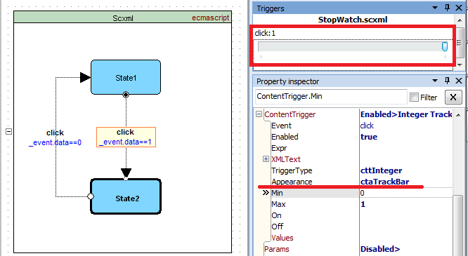
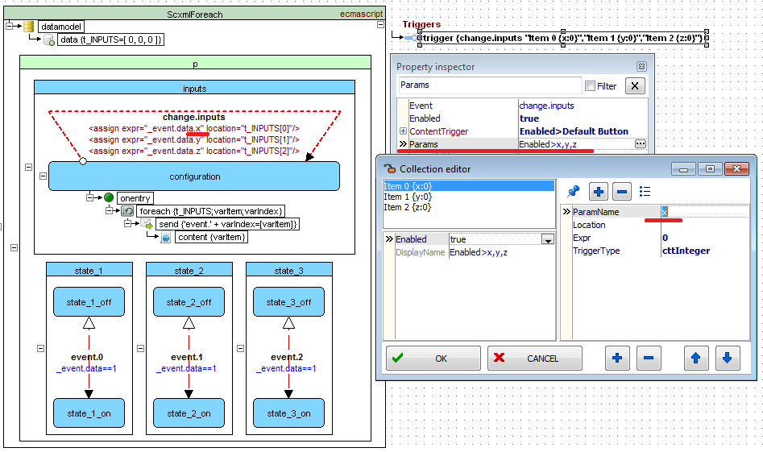
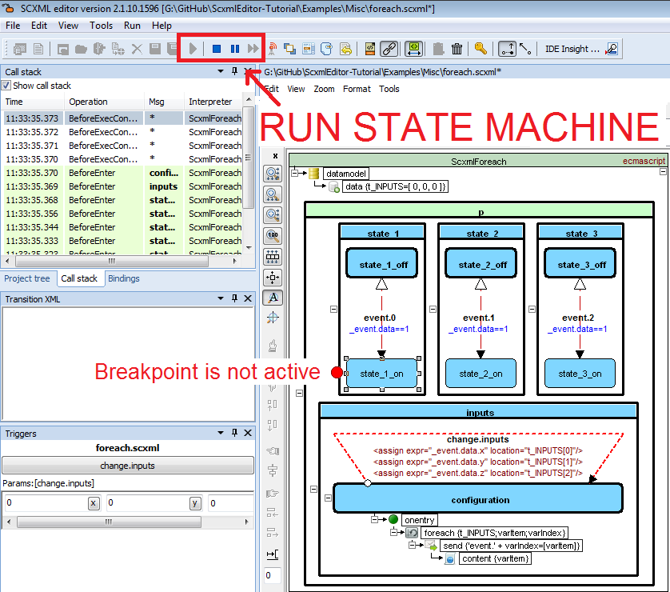
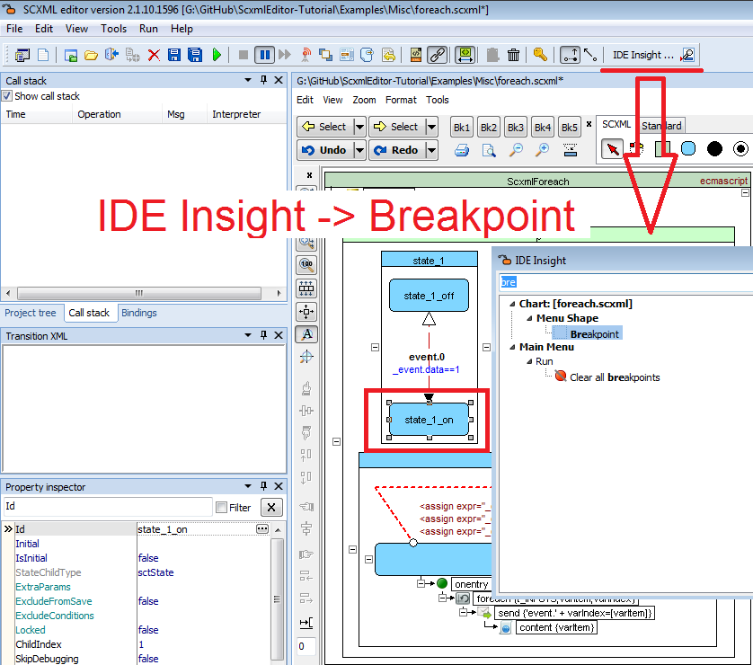
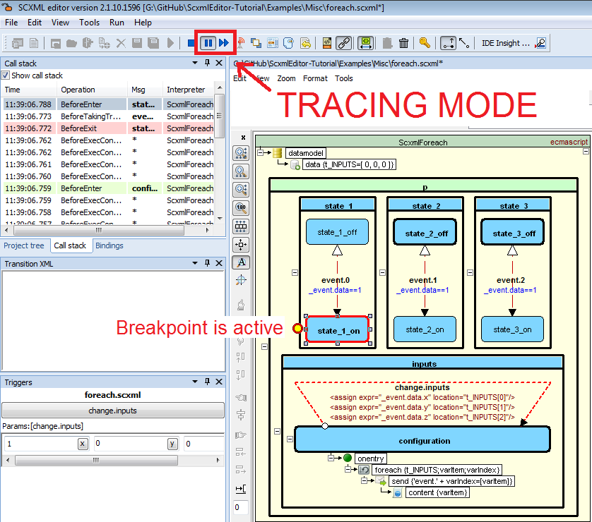
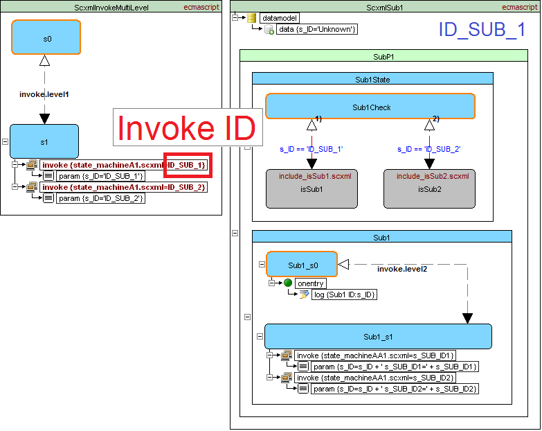
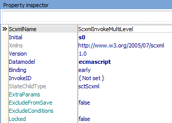
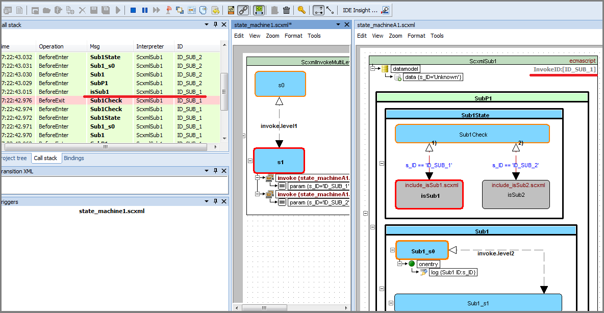
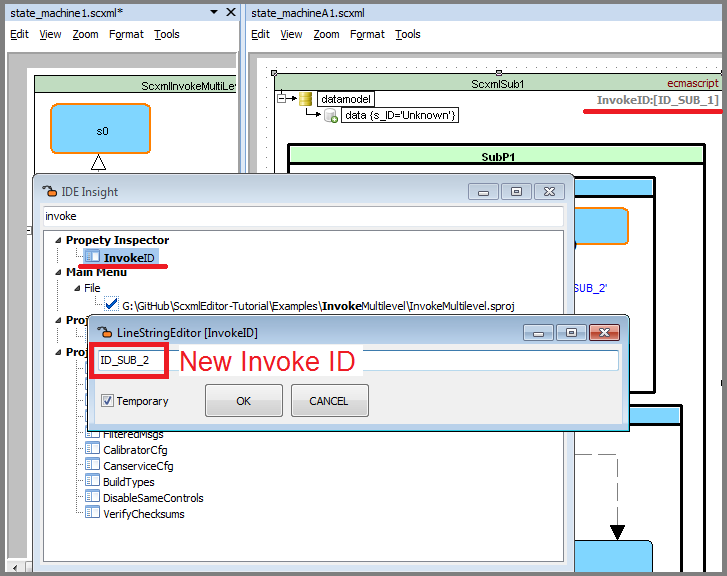
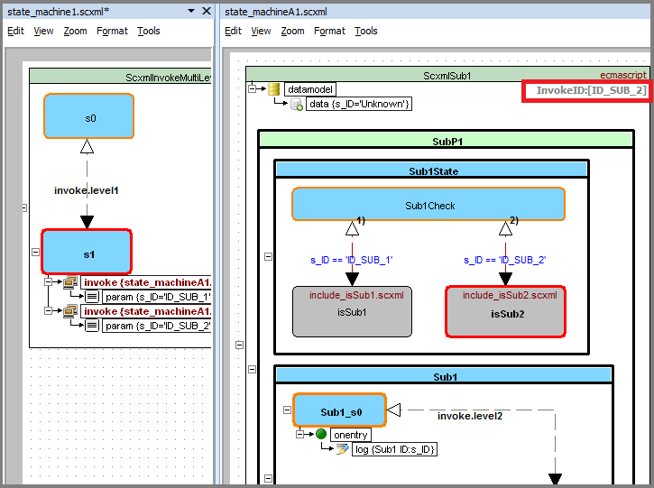

<a name="top-anchor"/>

| [Contents](../README.md#table-of-contents) | [SCXML Wiki](https://alexzhornyak.github.io/SCXML-tutorial/) | [Forum](https://github.com/alexzhornyak/ScxmlEditor-Tutorial/discussions) |
|---|---|---|

# How to debug [SCXML statecharts](https://alexzhornyak.github.io/SCXML-tutorial/)
**[ScxmlEditor](../README.md)** has an ability to execute [SCXML statecharts](https://alexzhornyak.github.io/SCXML-tutorial/) via testing applications or to listen external UDP commands such as state enter or exit, etc.

### Local debugging
ScxmlEditor starts a testing application, intercepts its command line output and may communicate in two modes:
- [**UDP mode**](#receive-api) (receives UDP commands and sends events as UDP packages to testing application)
- [**Pipes mode (since version 2.1.8)**](#custom-testing-application-setup) (capture enter-exit events from console output by regexp, and submit trigger event to state machine to console input)

There are two ready-to-use testing applications:

1. Based on [USCXML framework](https://github.com/tklab-tud/uscxml).
Supports **null, lua, ecmascript(since 2.1.5.1507)** datamodels

2. Based on [Qt SCXML framework](https://doc.qt.io/qt-5/qtscxml-index.html)
Supports **null, ecmascript** datamodels

Also you may write your own testing application using the corresponding API

### Receive API:
#### Commands to clear state charts
- `@@@` - clear highlighted states in all statecharts
- `@@@ScxmlName@Id` - clear highlighted states in statechart where [\<scxml\>](https://alexzhornyak.github.io/SCXML-tutorial/Doc/scxml.html) 'name' is equal `ScxmlName` and `Id` is the [identifier of the invoked state machine](https://alexzhornyak.github.io/SCXML-tutorial/Doc/invoke.html#id) when message comes from invoked session. `ScxmlName` or `Id` can be empty. In this case state chart will be cleared either by `ScxmlName` or `Id`
#### State chart processing commands
- `Type@ScxmlName@Msg@Id` - command to highlight state or display message in **CallStack** panel
**Description:**
1) `Type` - integer type of command: `1 - AfterEnter, 2 - BeforeEnter, 3 - AfterExit, 4 - BeforeExit, 5 - Step, 6 - BeforeExecContent, 7 - AfterExecContent, 8 - BeforeInvoke, 9 - AfterInvoke, 10 - BeforeUnInvoke, 11 - AfterUnInvoke, 12 - BeforeTakingTransition, 13 - AfterTakingTransition, 14 - StableConfiguration, 15 - BeforeProcessingEvent` <br/>
2) `ScxmlName` - name of [\<scxml\>](https://alexzhornyak.github.io/SCXML-tutorial/Doc/scxml.html) <br/>
3) `Msg` - message which depends on type of command. For example: for **BeforeEnter** or **BeforeExit** - it is the id(name) of states, for **BeforeInvoke** or **BeforeUnInvoke** it is the name of invoked element, etc. </br>
4) `Id` - [identifier of the invoked state machine](https://alexzhornyak.github.io/SCXML-tutorial/Doc/invoke.html#id) (Since **ScxmlEditor 2.2**). Can be empty for root machines
> **BeforeEnter** graphically highlight and **BeforeExit** unhighlight the corresponding states, other commands are displayed in **CallStack** panel
#### Example of commands:
- `2@CalculatorStateMachine@operand1` - highlight state **operand1** in statechart **CalculatorStateMachine** <br/>
- `4@CalculatorStateMachine@operand1` - unhighlight state **operand1** in statechart **CalculatorStateMachine** <br/>
- `2@ScxmlSub1@isSub1@ID_SUB_1` - highlight state **isSub1** in statechart **ScxmlSub1** when [invoke Id](#how-to-debug-multiple-invoked-state-machines) is **ID_SUB_1** <br/>

You can also [trace the execution of the chart](#trace-mode) and use [breakpoints](#breakpoints).

### Send API:
It is similar to [SCXML send events logic](https://alexzhornyak.github.io/SCXML-tutorial/Doc/send.html)

#### Testing application receives events as UDP string packages in the next format:
- `%EVENT_NAME%` - valid event name
- `%PARAM_NAME%` - valid param name
- `%DATA_TYPE%` - `0-Default`(Variant type), `1-Bool`, `2-Integer`, `3-Double`, `4-String`
- `%CONTENT_DATA%`,`%PARAM_DATA%` - event data depending on `%DATA_TYPE%`
#### Option 1. With single content expression
```xml
<EVENT name="%EVENT_NAME%" >
	<content type="%DATA_TYPE%" >
		%CONTENT_DATA%
	</content>
</EVENT>
```
#### Option 2. With multiple params
```xml
<EVENT name="%EVENT_NAME%" >
	<param name="%PARAM_NAME%" type="%DATA_TYPE%" expr="%PARAM_DATA%">
	<param name="%PARAM_NAME%" type="%DATA_TYPE%" expr="%PARAM_DATA%">
</EVENT>
```

## Triggers
Triggers will create a GUI elements for passing data to statechart
- #### May be assigned as `trigger shapes` in statechart


- #### May be applied via `ContentTrigger` property of `transition`


### Type of triggers representation
- #### Default


- #### CheckBox


- #### ComboBox


- #### TrackBar


### Nested `event.data` params
If you need to pass nested `event.data` like `event.data.val` there is a menu **Params** in inspector


**DEMO.** In runtime params will be represented as edits with buttons


## Breakpoints
You can associate breakpoints with states. When the state with breakpoint set is entered, state machine events queue is interrupted and program highlights the breakpoint and changes the scxml root element background into light yellow colour.

### Adding breakpoints
- select shape
- set 'Breakpoint' menu option checked


### Trace mode
In trace mode state machine event queue is interrupted and waits for user 'Next Step' button is clicked. 

This mode is activated when:
- breakpoint is triggered
- pause button is pressed



## How to debug multiple invoked state machines
Let's take a look at the example when state machine invokes two same nested state machines


### Invoke ID

> If invoke identifier of submachine is not set then the first identifier is used


### How to change current Invoke ID
- Select SCXML element
- Call IDE Insight 'InvokeID'
- Type new id





## External debugging
In this mode ScxmlEditor only listens UDP commands for highlighting states and displaying messages in CallStack panel

### [Qt SCXML framework debugging](../Include/README.md)

#### NEW! [Qt SCXML Debug Via SVG](../Include/README.md)
It was an old dream to monitor state machine workflow without any external dependencies it Qt and finally it comes true. </b>
We prepared some native SCXML SVG monitors:
- [scxmlsvgview.h](../Include/scxmlsvgview.h) - for widgets (based on QGraphicsView)
    - see how to use it in [Dining Philosophers Example](https://github.com/alexzhornyak/SCXML-tutorial/tree/master/Examples/Qt/DiningPhilosophers)
- [scxmlsvgqmlitem.h](../Include/scxmlsvgqmlitem.h) - for QML (based on QQuickPaintedItem)
    - see how to use it in [Stopwatch Example](https://github.com/alexzhornyak/SCXML-tutorial/tree/master/Examples/Qt/StopWatch)


Since ScxmlEditor 2.2.1 you can export SCXML to SVG, include only monitor headers in your app and create monitor instances any time. 
> **NOTICE:** While state machine pointer is not set, the monitor **does nothing** and can be left in **Release**.

#### [Qt SCXML External Debugging with ScxmlEditor](../Include/README.md#qt-scxml-external-debugging-monitor)
For Qt SCXML applications you may include [scxmlexternmonitor2.h](../Include/scxmlexternmonitor2.h) header to your project and follow [the instructions](../Include/README.md)

#### Example of debugging Qt Calculator-QML project


1. Select **Run**->**Start listening from external application**
2. Select **Run**->**Run**
3. Launch **Calculator-QML.exe**
4. Use **Pause** for tracing (optionally)


## Custom testing application setup
Since version 2.1.8 there is an option to communicate with testing applications via pipes.
#### Example: how to setup [The SCION command-line tool](https://gitlab.com/scion-scxml/cli) as custom testing application
1) install [SCION CLI](https://gitlab.com/scion-scxml/cli) by command `npm install -g @scion-scxml/cli`
2) after installation check [c:\Users\USER_NAME\AppData\Roaming\npm\node_modules\@scion-scxml\cli\bin\cli.js](https://gitlab.com/scion-scxml/cli/-/raw/master/bin/cli.js) is to be the latest from the corresponding [gitlab repo](https://gitlab.com/scion-scxml/cli)
3) run any test scxml file in CMD to check that [SCION CLI](https://gitlab.com/scion-scxml/cli) is working [without errors](https://gitlab.com/scion-scxml/scion/-/issues/5)

4) open `Settings->TestApplicationPresets` and check that it is properly adjusted according to the image below


> If API is changed in the future you may edit regular expressions to capture enter-exit events properly
5) select SCION CLI in application run presets

6) if everything is set properly you will see callstack messages and state machine will flow from state to state


| [TOP](#top-anchor) | [Contents](../README.md#table-of-contents) | [SCXML Wiki](https://alexzhornyak.github.io/SCXML-tutorial/) | [Forum](https://github.com/alexzhornyak/ScxmlEditor-Tutorial/discussions) |
|---|---|---|---|
