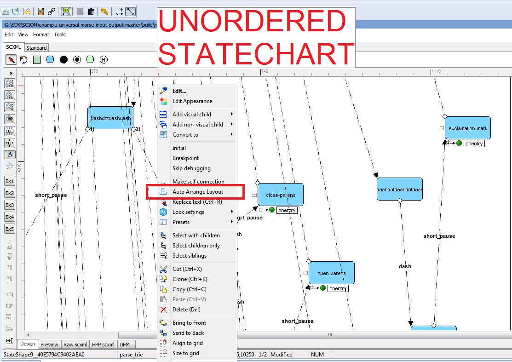
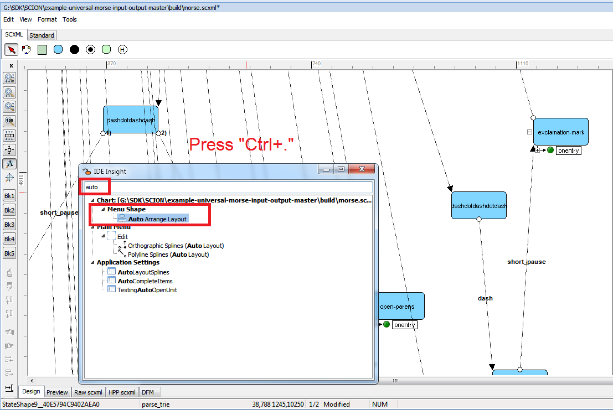
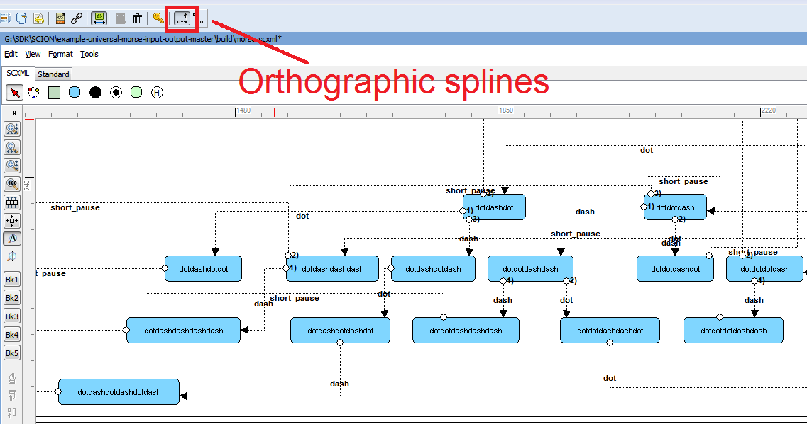
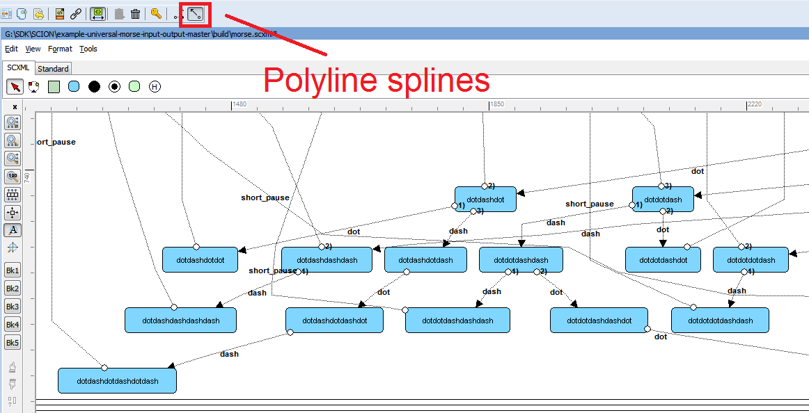
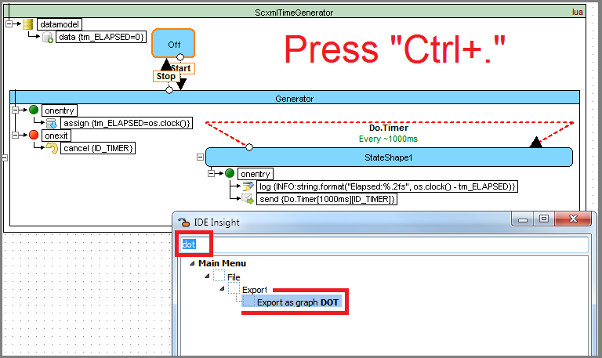
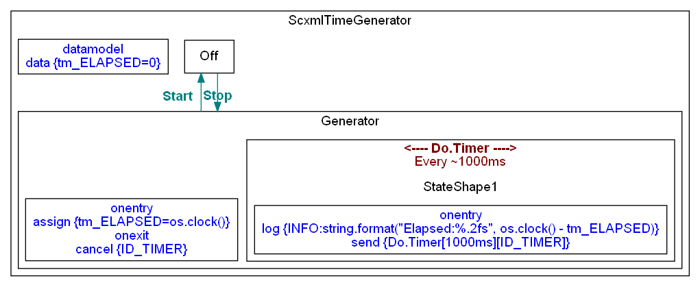
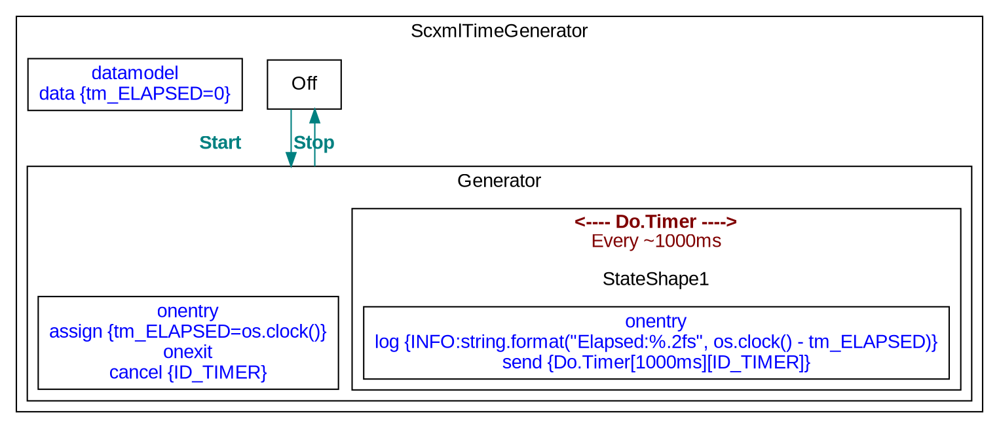
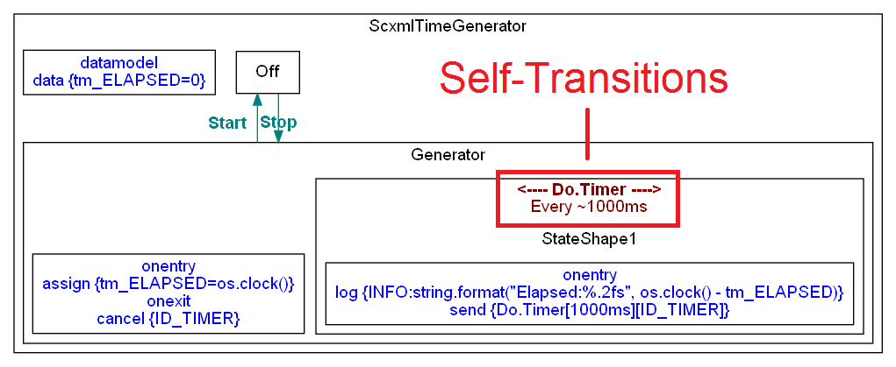
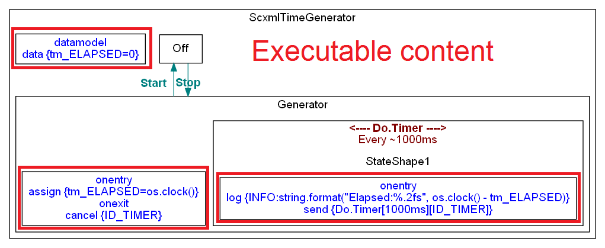

<a name="top-anchor"/>

| [Contents](../README.md#table-of-contents) | [SCXML Wiki](https://alexzhornyak.github.io/SCXML-tutorial/) | [Forum](https://github.com/alexzhornyak/ScxmlEditor-Tutorial/discussions) |

# DOT-based Auto-Layout

Since version **2.1.0.1347** auto-layout option is based on Graphviz DOT render.

### Requirements
1. [Visual C++ Redistributable for Visual Studio 2015](https://www.microsoft.com/en-us/download/details.aspx?id=48145) must be installed

2. **ScxmlEditor\Graphviz** core must be present

## Auto-layout is applied when:
**1.** **The SCXML document without shapes and connections metainformation** is opened

**2.** User calls **'Auto Arrange Layout'** option.

## How to automatically arrange layout
**1.** Press right mouse button somewhere on the chart and select menu 'Auto Arrange Layout'

**2.** Or press "**Ctrl + .**" shorcut and type "Auto" in **IDE Insight** focus search dialog

**3.** Select **Orthographic splines** option to have square-like connections (default)

**4.** Select **Polyline splines** option to draw connections as polylines

## How to convert SCXML to DOT
#### 1. Search in IDE Insight (Ctrl+.) "DOT" or select menu "File->Export->Export as graph DOT"

#### 2. Save as Graphviz (\*.gl) file

## Special SCXML to DOT convertation features

### 1. Graphviz cluster can not be connected to itself so self-transitions are encoded in cluster label

### 2. Executable content is represented in single node without edges

# Examples

## Example 1. Autolayouting [Morse Code Trainer](https://github.com/alexzhornyak/SCXML-tutorial/tree/master/Examples/Qt/Morse) source code SCXML

## Example 2. Autolayoting LCCA tests from [USCXML Benchmarks Tests](https://github.com/tklab-tud/uscxml/blob/master/docs/BENCHMARKS.md)

| [TOP](#top-anchor) | [Contents](../README.md#table-of-contents) | [SCXML Wiki](https://alexzhornyak.github.io/SCXML-tutorial/) | [Forum](https://github.com/alexzhornyak/ScxmlEditor-Tutorial/discussions) |
