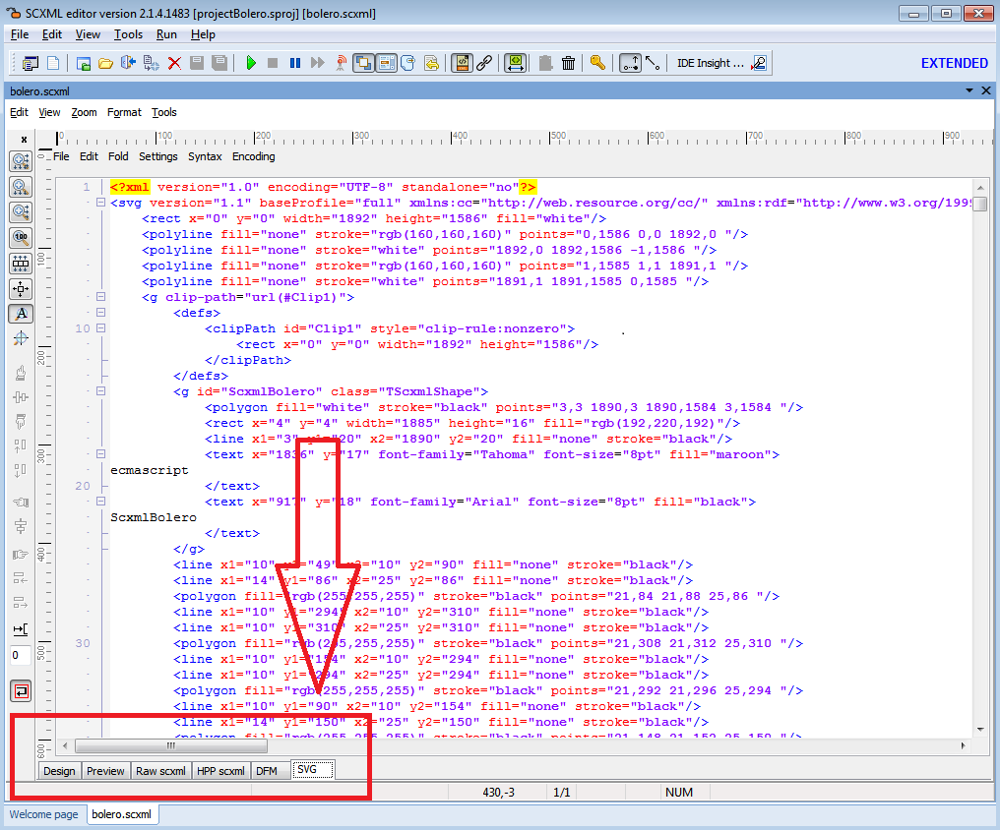
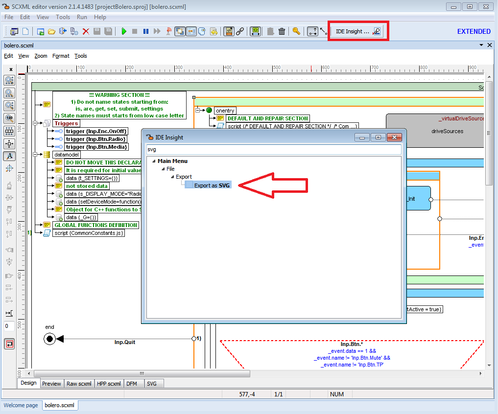
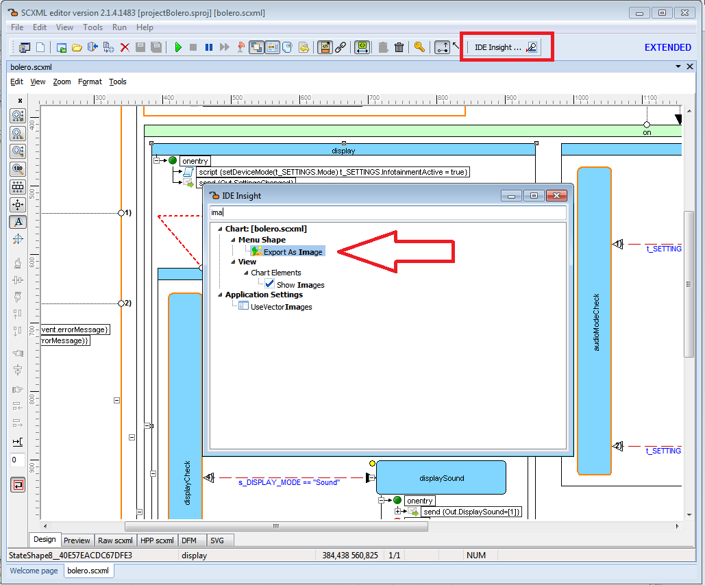
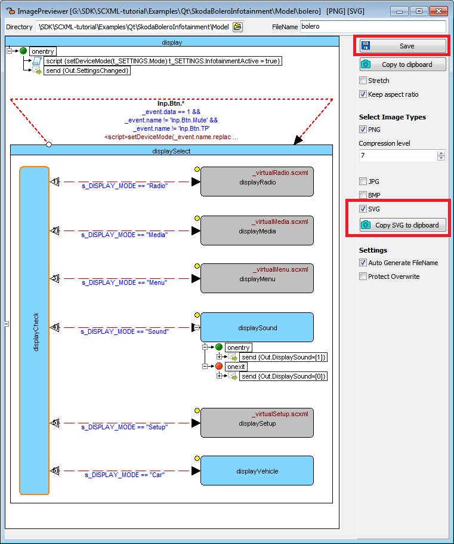

# Export SCXML to SVG

There are a couple ways to exprt SCXML to SVG.

### 1. Quick view SVG source code by switching to the 'SVG' tab

### 2. Save all statechart to file by IDE Insight command (type 'SVG')

### 3. Save selected state to file or copy to clipboard by IDE Insight command (type 'Image')

