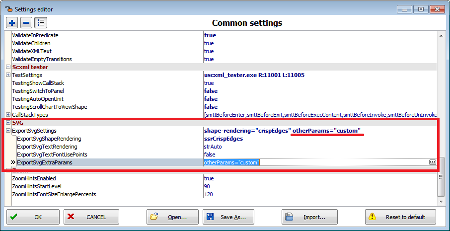

<a name="top-anchor"/>

| [Contents](../README.md#table-of-contents) | [SCXML Wiki](https://alexzhornyak.github.io/SCXML-tutorial/) | [Forum](https://github.com/alexzhornyak/ScxmlEditor-Tutorial/discussions) |
|---|---|---|

# Export [SCXML](https://alexzhornyak.github.io/SCXML-tutorial/) to [SVG](https://www.w3.org/Graphics/SVG/)
> For Qt programmers: see how to use SVG as source for [Qt SCXML Debug](https://github.com/alexzhornyak/QtScxmlMonitor/blob/main/README.md)

There are a couple ways to export [SCXML](https://alexzhornyak.github.io/SCXML-tutorial/) to [SVG](https://www.w3.org/Graphics/SVG/).

### 1. Quick view SVG source code by switching to the 'SVG' tab

### 2. Save all statechart to file by IDE Insight command (type 'SVG')

### 3. Save selected state to file or copy to clipboard by IDE Insight command (type 'Image')

## Example 1. Part of state chart exported

## Example 2. All state chart exported

## SVG Export Settings
Since ScxmlEditor 2.1.7 there are available export settings:
- **ExportSvgShapeRendering** appends SVG attribute `shape-rendering` with values `auto | optimizeSpeed | crispEdges | geometricPrecision`

- **ExportSvgTextRendering** appends SVG attribute `text-rendering` with values `auto | optimizeSpeed | optimizeLegibility | geometricPrecision`

- **ExportSvgTextFontUsePoints** boolean value used for adjusting font size values:
1) if it is set to **true** then font size is given in points with extension `pt` (Example: `font-size="8pt"`)
2) if it is set to **false** then font size is calculated by expression `Font->Size * Screen->PixelsPerInch / 72.0f` (Example: `font-size="10.67"`)

- **ExportSvgExtraParams** appends user defined params to SVG element

SVG attributes text-rendering and shape-rendering are predefined and may be changed from settings

And there is an option to use custom SVG element attributes

### Example: `shape-rendering="crispEdges"`

| [TOP](#top-anchor) | [Contents](../README.md#table-of-contents) | [SCXML Wiki](https://alexzhornyak.github.io/SCXML-tutorial/) | [Forum](https://github.com/alexzhornyak/ScxmlEditor-Tutorial/discussions) |
|---|---|---|---|
