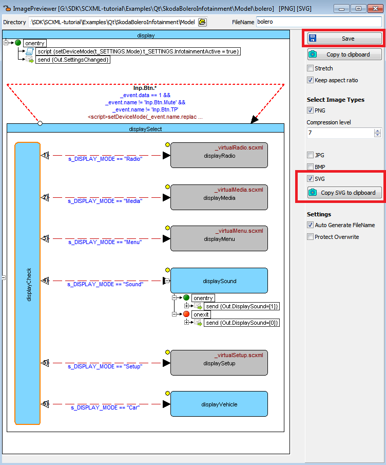

<a name="top-anchor"/>

| [Contents](../README.md#table-of-contents) | [SCXML Wiki](https://alexzhornyak.github.io/SCXML-tutorial/) | [Forum](https://github.com/alexzhornyak/ScxmlEditor-Tutorial/discussions) |
|---|---|---|

# Export [SCXML](https://alexzhornyak.github.io/SCXML-tutorial/) to [SVG](https://www.w3.org/Graphics/SVG/)

There are a couple ways to export [SCXML](https://alexzhornyak.github.io/SCXML-tutorial/) to [SVG](https://www.w3.org/Graphics/SVG/).

### 1. Quick view SVG source code by switching to the 'SVG' tab

### 2. Save all statechart to file by IDE Insight command (type 'SVG')

### 3. Save selected state to file or copy to clipboard by IDE Insight command (type 'Image')

## Example 1. Part of state chart exported

## Example 2. All state chart exported

| [TOP](#top-anchor) | [Contents](../README.md#table-of-contents) | [SCXML Wiki](https://alexzhornyak.github.io/SCXML-tutorial/) | [Forum](https://github.com/alexzhornyak/ScxmlEditor-Tutorial/discussions) |
|---|---|---|---|