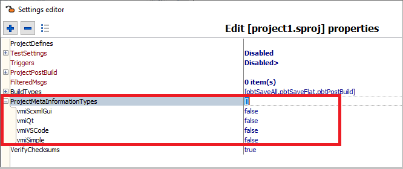
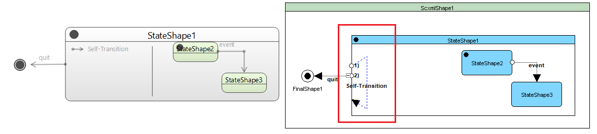
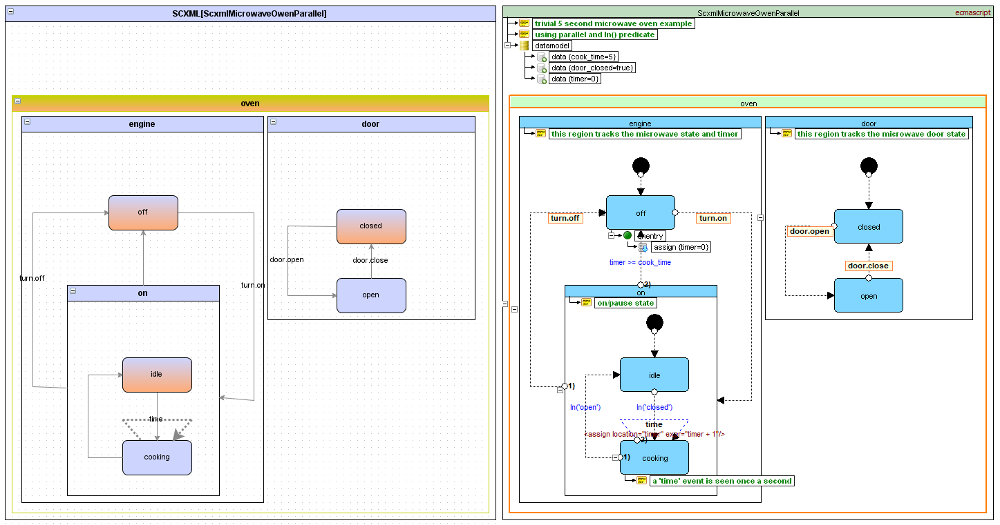

<a name="top-anchor"/>

| [Contents](../README.md#table-of-contents) | [SCXML Wiki](https://alexzhornyak.github.io/SCXML-tutorial/) | [Forum](https://github.com/alexzhornyak/ScxmlEditor-Tutorial/discussions) |
|---|---|---|

# Export SCXML charts with layout metainformation
ScxmlEditor has its own binary layout metainformation that can not be easily parsed. There were a multiple requests to be able to store a chart graphical layout as readable text format. Graphical metainformation can be added in the next formats:
- [Qt Creator](#qt-creator)
- [ScxmlGui](#scxmlgui)
- [VSCode](#vscode)
- [Simple Visual](#simple-visual-metainformation-format)

## Metainformation modes
### Project Mode (Permanent metainformation using project options)
There is an ability to add layout metainformation every time when you are saving scxml files. This is available in Project mode if the corresponding type of metainformation option is set.

### Export Mode (Export file with metainformation by calling an action)
If you do not want to change your current file, you can export it with different file name and add metainformation there.

## Metainformation types
### [Qt Creator](https://doc.qt.io/qtcreator/creator-scxml.html)
State charts will be saved with [Qt Creator](https://doc.qt.io/qtcreator/creator-scxml.html) graphical metainformation

|  |
|---|
| Example of Qt Creator metainformation |

|  |
|---|
| Comparison of Qt Creator and ScxmlEditor layouts |

> **WARNING:** If self-transition is present in state, it is displayed inside of a state and state width is increased!

> **NOTE:** Use self-transition location at the left side inside of a state

### [VSCode](https://marketplace.visualstudio.com/items?itemName=Phrogz.visual-scxml-editor)
State charts will be saved with [VSCode](https://marketplace.visualstudio.com/items?itemName=Phrogz.visual-scxml-editor) graphical metainformation

|  |
|---|
| Example of VSCode metainformation |

|  |   |
|---|---|
| VSCode target layout | ScxmlEditor source layout |

> **WARNING:** Invoked state machines could be wrongly represented by VSCode side!

### [ScxmlGui](https://github.com/fmorbini/scxmlgui)
State charts will be saved with [ScxmlGui](https://github.com/fmorbini/scxmlgui) graphical metainformation

|  |
|---|
| Example of ScxmlGui metainformation |

|  |
|---|
| Comparison of VSCode and ScxmlEditor layouts |

> **WARNING:** ScxmlGui does not recognize UTF8-with-BOM encoding. So use only "Export as ScxmlGui" option, because scxml project files are written with BOM!

### Simple Visual metainformation format
This is custom very simple graphical metainformation format. All points are written in absolute chart coordinates.

|  |
|---|
| Example of Simple Visual metainformation |

## How to handle [virtual sub states](VisualStateChartSplitting.md)
If your state chart contains [virtual sub states](VisualStateChartSplitting.md) then [Project Mode](#project-mode-permanent-metainformation-using-project-options) may be unacceptable because it can create a mess in the resulting state chart.

|  |  |
|---|---|
| Example of virtual sub state | Virtual sub state layout is messed up |

In this case you can use [post-save](ProjectTree.md#post-save-unit-actions) option to save state chart in [Export Mode](#export-mode-export-file-with-metainformation-by-calling-an-action)

|  |
|---|
| Exported name is extended with suffix "_meta" |

|  |  |
|---|---|
| Virtual sub state will be only presented as single state | There will be a comment with the virtual source unit |

---
| [TOP](#top-anchor) | [Contents](../README.md#table-of-contents) | [SCXML Wiki](https://alexzhornyak.github.io/SCXML-tutorial/) | [Forum](https://github.com/alexzhornyak/ScxmlEditor-Tutorial/discussions) |
|---|---|---|---|
