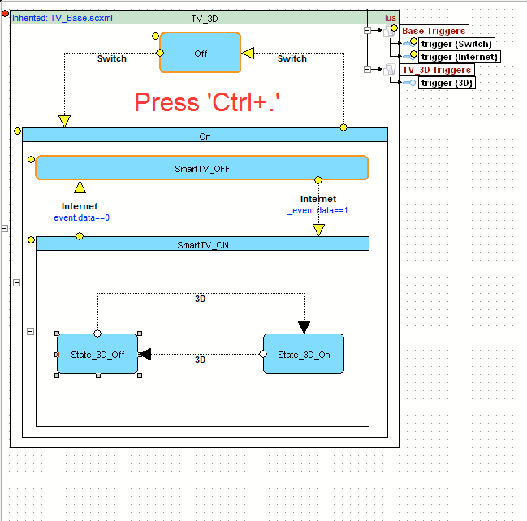

<a name="top-anchor"/>

| [Contents](../README.md#table-of-contents) | [SCXML Wiki](https://alexzhornyak.github.io/SCXML-tutorial/) | [Forum](https://github.com/alexzhornyak/ScxmlEditor-Tutorial/discussions) |
|---|---|---|

# IDE Insight
IDE Insight displays a pop-up window when there are matching items for the string that you type in the search box. The pop-up window shows as many matching items as fit on your screen.

You can navigate the displayed items using the Up and Down arrow keys. You can use the PageUp and PageDown keys to navigate to the first and last item, respectively.

The IDE Insight pop-up window displays the matching items within the displayed item categories. As you type the name of an item into the search field, only the categories that contain matching items are displayed.

| [TOP](#top-anchor) | [Contents](../README.md#table-of-contents) | [SCXML Wiki](https://alexzhornyak.github.io/SCXML-tutorial/) | [Forum](https://github.com/alexzhornyak/ScxmlEditor-Tutorial/discussions) |
|---|---|---|---|
