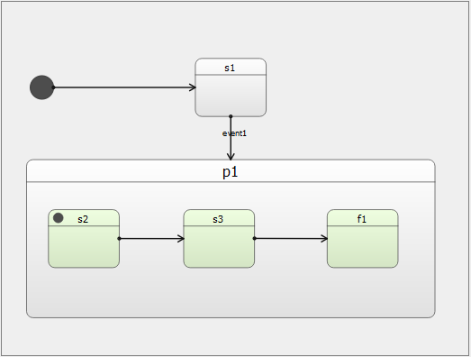
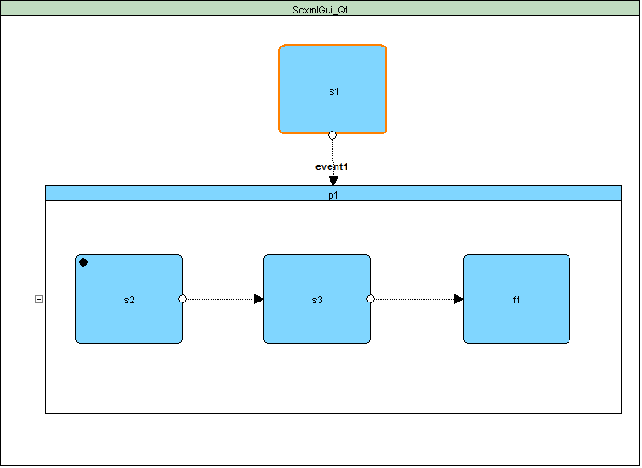
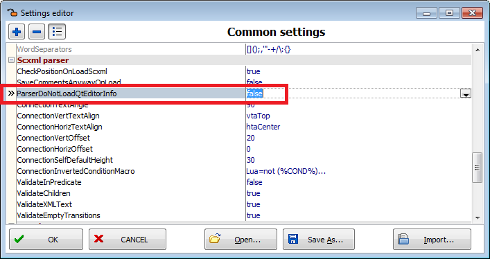
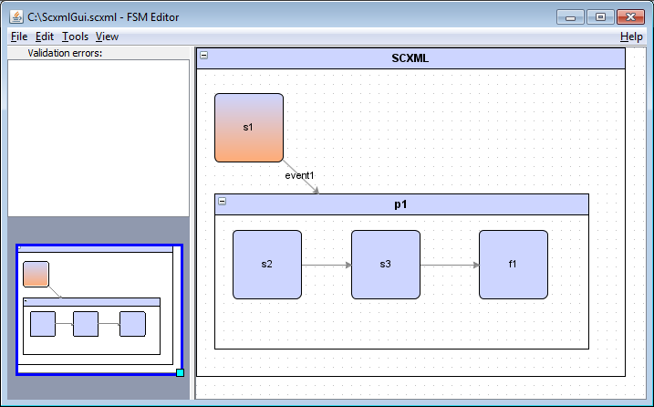
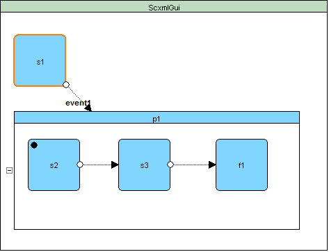
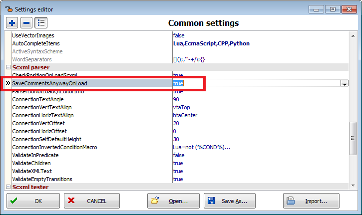

<a name="top-anchor"/>

| [Contents](../README.md#table-of-contents) | [SCXML Wiki](https://alexzhornyak.github.io/SCXML-tutorial/) | [Forum](https://github.com/alexzhornyak/ScxmlEditor-Tutorial/discussions) |
|---|---|---|

# SCXML Import

## Import from [QtCreator state charts](https://doc.qt.io/qtcreator/creator-scxml.html) (Since 2.2.4)
**QtCreator** state charts has visual layout metainformation that is decoded with **qt:editorinfo** nodes



```xml
<?xml version="1.0" encoding="UTF-8"?>
<scxml xmlns="http://www.w3.org/2005/07/scxml" version="0.9" binding="early" qt:editorversion="4.14.0" xmlns:qt="http://www.qt.io/2015/02/scxml-ext" initial="s1">
    <qt:editorinfo initialGeometry="-231.46;2.80;-20;-20;40;40"/>
    <state id="s1">
        <qt:editorinfo scenegeometry="61.89;2.80;1.89;-47.20;120;100" geometry="61.89;2.80;-60;-50;120;100"/>
        <transition type="internal" event="event1" target="p1"/>
    </state>
    <state id="p1">
        <qt:editorinfo scenegeometry="-100.30;215.09;-260.30;109.77;644.39;255.32" geometry="-100.30;215.09;-160;-105.32;644.39;255.32"/>
        <state id="s2">
            <qt:editorinfo scenegeometry="-166.31;237.43;-226.31;187.43;120;100" geometry="-66.01;22.34;-60;-50;120;100"/>
            <transition type="internal" target="s3"/>
        </state>
        <state id="s3">
            <qt:editorinfo scenegeometry="43.78;237.43;-16.22;187.43;120;100" geometry="144.08;22.34;-60;-50;120;100"/>
            <transition type="internal" target="f1"/>
        </state>
        <state id="f1">
            <qt:editorinfo scenegeometry="266.67;237.43;206.67;187.43;120;100" geometry="366.97;22.34;-60;-50;120;100"/>
        </state>
    </state>
</scxml>
```

### Restrictions
- states color info is not supported
- scxml initial shape is not created separately
- labels positioning is automatic



> **NOTICE:** If you want to store **qt:editorinfo** set **IDE Insight -> ParserDoNotLoadQtEditorInfo** to **False**



## Import from [ScxmlGui (by fmorbini)](https://github.com/fmorbini/scxmlgui) state charts


**ScxmlGui** state charts has visual layout metainformation that is decoded with **comments**
```xml
<scxml initial="s1" version="0.9" xmlns="http://www.w3.org/2005/07/scxml"><scxml initial="s1" version="0.9" xmlns="http://www.w3.org/2005/07/scxml"><!--   node-size-and-position x=0 y=0 w=470 h=360  -->
 <state id="s1"><!--   node-size-and-position x=20 y=50 w=75 h=75  -->
  <transition event="event1" target="p1"></transition>
 </state>
 <state id="p1"><!--   node-size-and-position x=20 y=160 w=410 h=170  -->
  <state id="s2"><!--   node-size-and-position x=20 y=40 w=75 h=75  -->
   <transition target="s3"></transition>
  </state>
  <state id="s3"><!--   node-size-and-position x=150 y=40 w=75 h=75  -->
   <transition target="f1"></transition>
  </state>
  <state id="f1"><!--   node-size-and-position x=290 y=40 w=75 h=75  --></state>
 </state>
</scxml
```

**ScxmlEditor** applies visual layout to states and **does not store** the visual metainformation by default



> **NOTICE:** If you want to store visual metainformation set **IDE Insight -> SaveCommentsAnyWayOnLoad** to **True**



| [TOP](#top-anchor) | [Contents](../README.md#table-of-contents) | [SCXML Wiki](https://alexzhornyak.github.io/SCXML-tutorial/) | [Forum](https://github.com/alexzhornyak/ScxmlEditor-Tutorial/discussions) |
|---|---|---|---|

