# [Inheritance](https://github.com/alexzhornyak/SCXML-tutorial/blob/master/Doc/Inheritance_SCXML.md)

An option to inherit from base chart.

### 1. Create empty project
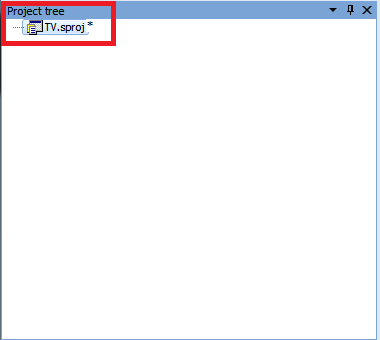

### 2. Add base chart
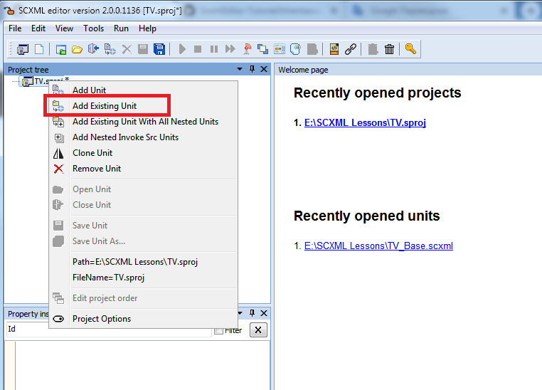

### 3. Add new chart which is planned to be derived
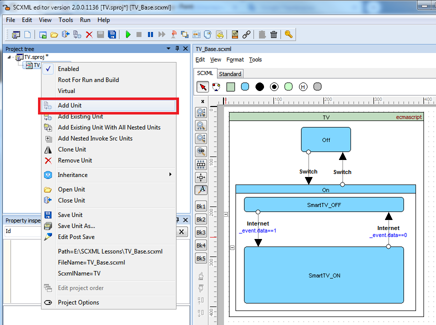

### 4. Select base chart for setting inheritance
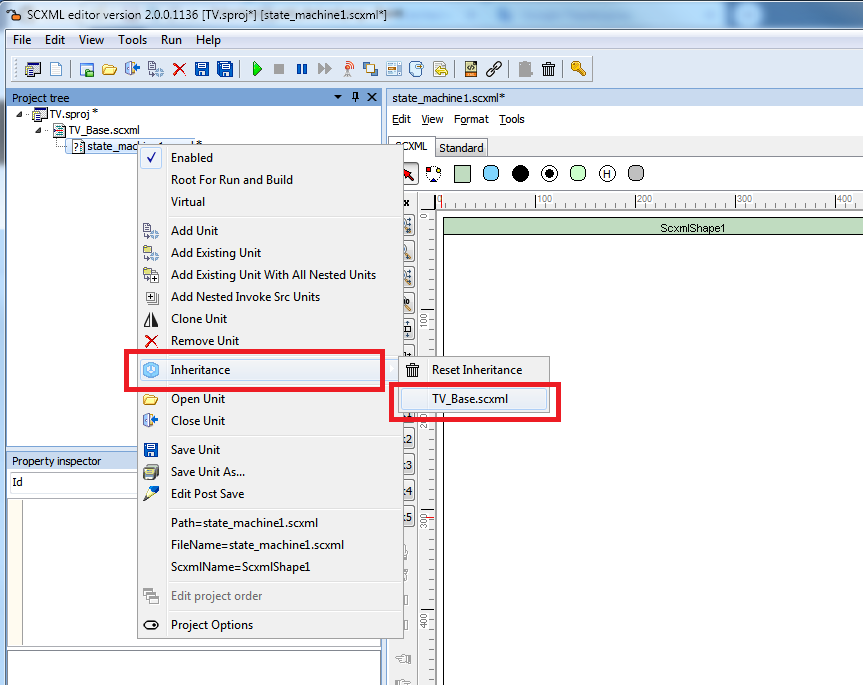

### 5. Confirm adding inheritance
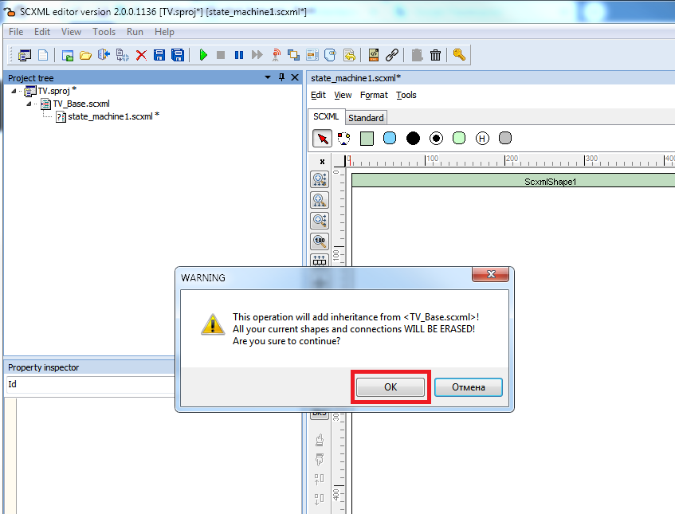

If operation is successful you will see all states marked with **yellow circles**. That means **full matching** to base chart

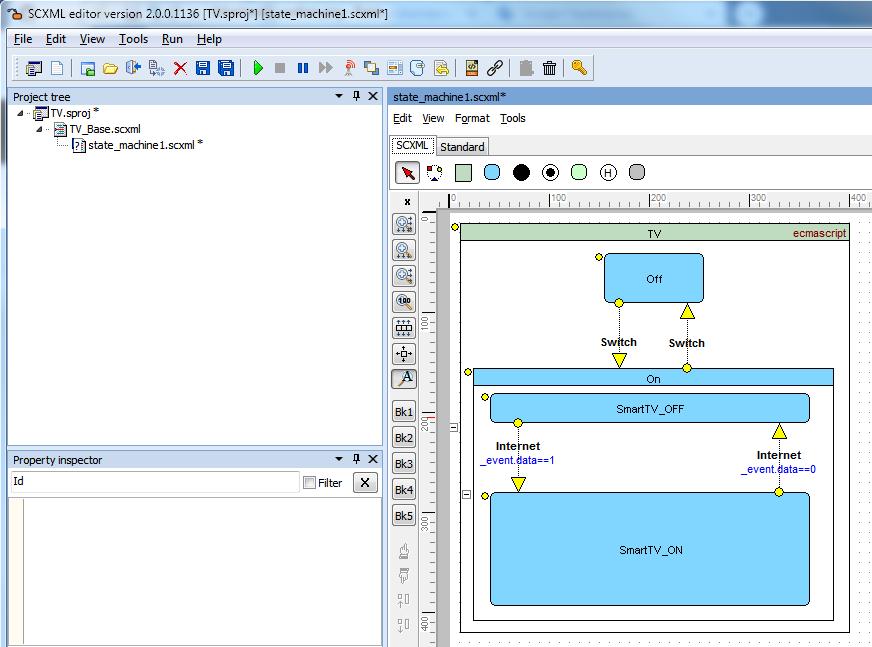

### 6. Give unique state machine name and save the unit with the corresponding name
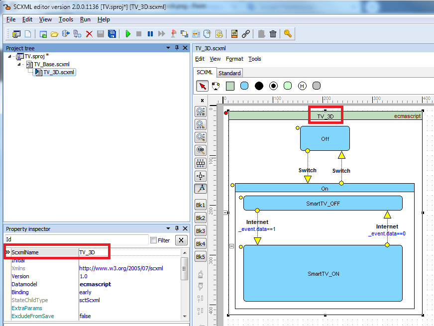

### 7. Set root for run and build if your new unit will be the main in the project
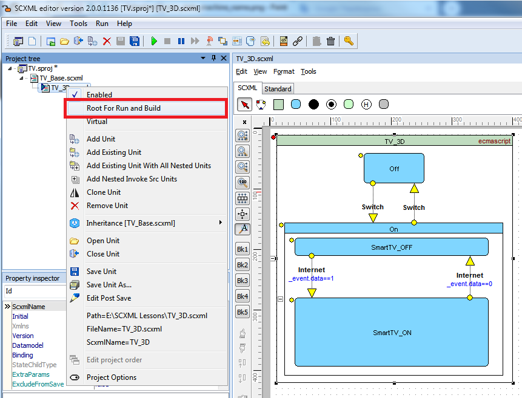

## Description
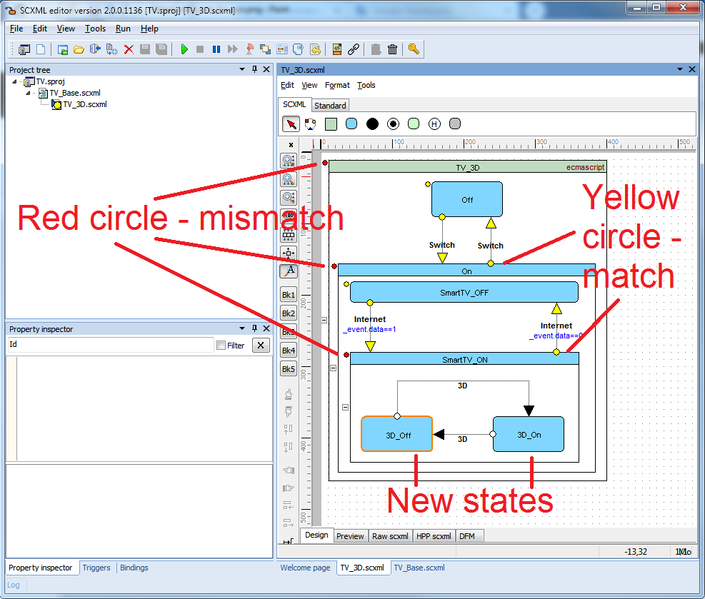

#### Red circle - means that there is a difference with the base state chart. You can see the log files for details
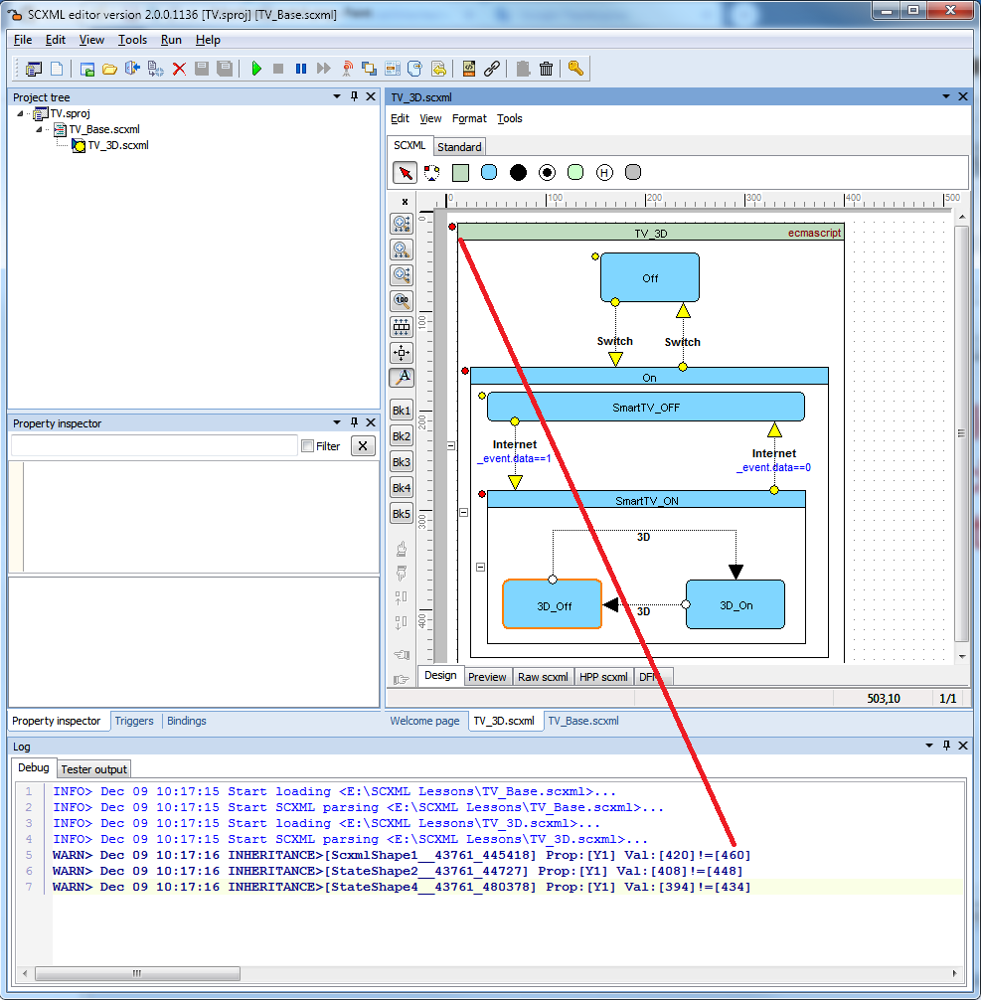

#### Yellow circle - means that there is no difference with the base state chart

#### New states - will be marked without additional signs

## How to resolve mismatches
Since version 2.1 there is an option to mark mismatches as resolved
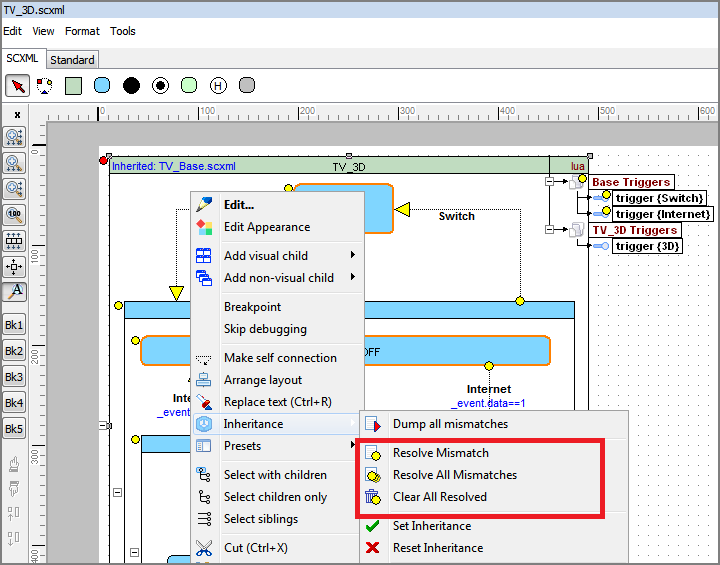

You may review resolved values in property **InheritanceResolver**. 

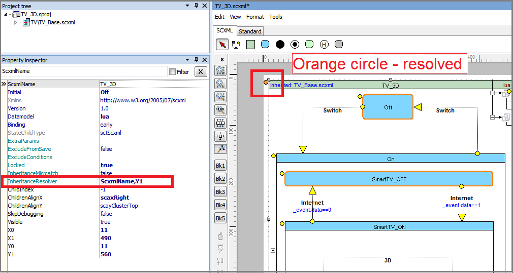

#### Elements with resolved properties will be marked with orange circle.
