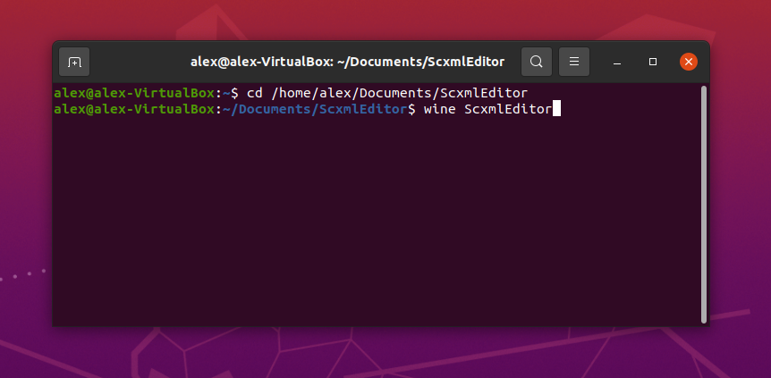
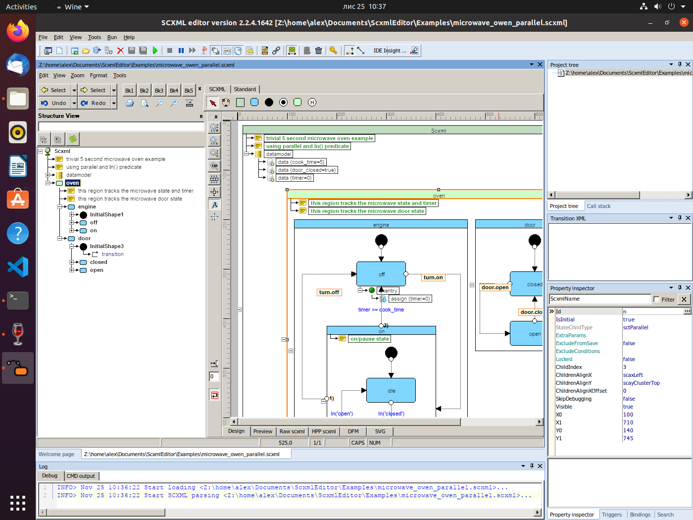

<a name="top-anchor"/>

| [Contents](../README.md#table-of-contents) | [SCXML Wiki](https://alexzhornyak.github.io/SCXML-tutorial/) | [Forum](https://github.com/alexzhornyak/ScxmlEditor-Tutorial/discussions) |
|---|---|---|

# [ScxmlEditor](../README.md) Linux Installation
Great news for Linux Users! It is available to use ScxmlEditor via [Wine](https://www.winehq.org/)

1. **Install [Wine](https://www.winehq.org/):**
```batch
sudo apt -y install wine
```
2. **Install Microsoft fonts**
- Install a collection of Microsoft fonts.
```batch
sudo apt install ttf-mscorefonts-installer
```
- Acknowledge the terms of the EULA in your terminal when prompted.
3. Download from latest Release page and unpack it in any target location
4. Run program
```batch
cd /path/to/ScxmlEditor
wine ScxmlEditor.exe
```




| [TOP](#top-anchor) | [Contents](../README.md#table-of-contents) | [SCXML Wiki](https://alexzhornyak.github.io/SCXML-tutorial/) | [Forum](https://github.com/alexzhornyak/ScxmlEditor-Tutorial/discussions) |
|---|---|---|---|