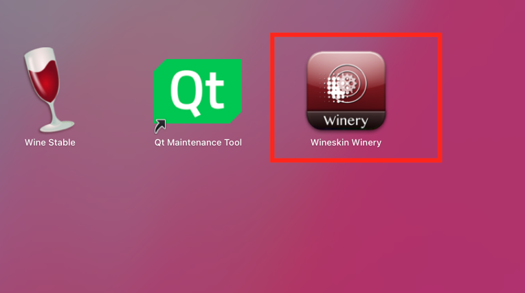
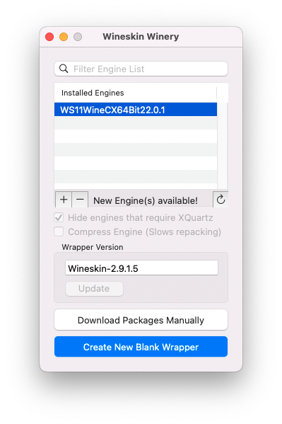
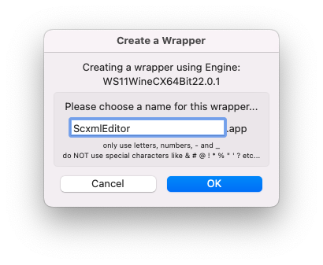
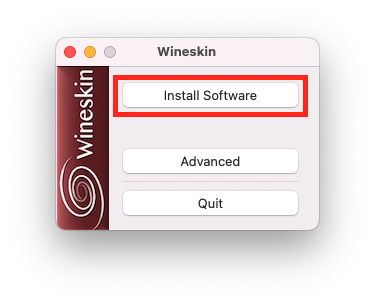
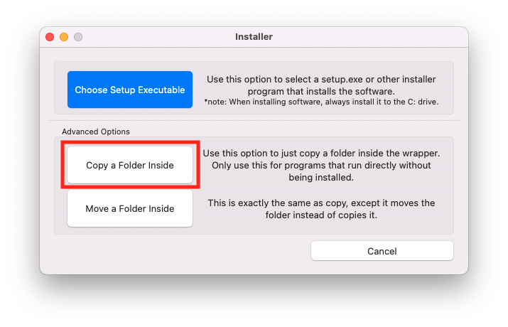
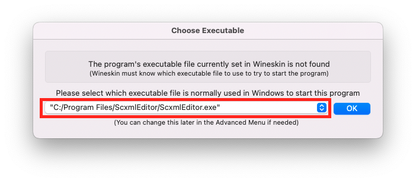
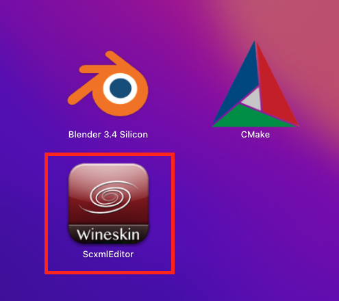
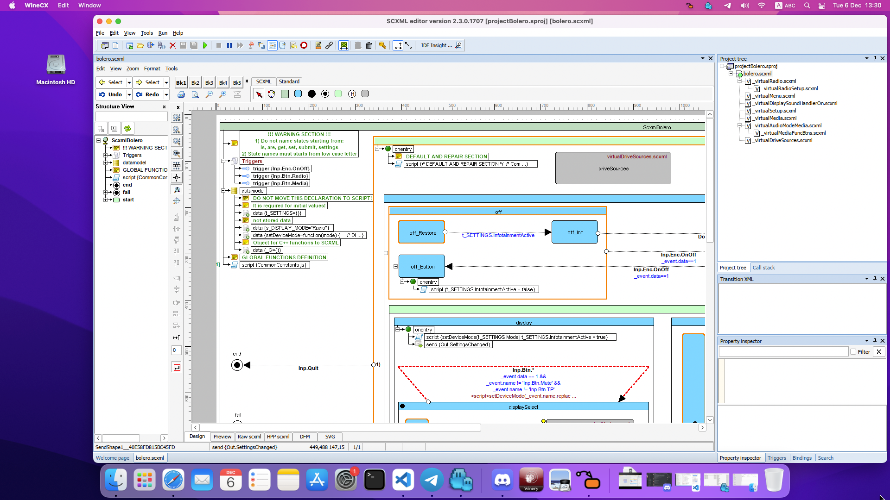

<a name="top-anchor"/>

| [Contents](../README.md#table-of-contents) | [SCXML Wiki](https://alexzhornyak.github.io/SCXML-tutorial/) | [Forum](https://github.com/alexzhornyak/ScxmlEditor-Tutorial/discussions) |
|---|---|---|

# [ScxmlEditor](../README.md) Mac OS Installation
The only way that was found to use ScxmlEditor on Mac OS is via [Wine](https://www.winehq.org/) and [Wineskin](https://github.com/Gcenx/WineskinServer)

1. Download **ScxmlEditor.zip** from latest Release page and unpack it in any target location

2. **Install [Wine](https://www.winehq.org/):**
```batch
brew tap homebrew/cask-versions
brew install --cask --no-quarantine wine-stable
```

3. **Install [Wineskin](https://github.com/Gcenx/WineskinServer)**
- Install Wineskin Server
```batch
brew install --no-quarantine gcenx/wine/unofficial-wineskin
```
- Start Wineskin


- Install Wineskin Engine, Wrapper Version


- Create new blank Wineskin wrapper


- Press **Install Software** button after creation was completed


- **Copy** or **Move** ScxmlEditor folder inside


- Select ScxmlEditor executable


4. Run program


## Preview


| [TOP](#top-anchor) | [Contents](../README.md#table-of-contents) | [SCXML Wiki](https://alexzhornyak.github.io/SCXML-tutorial/) | [Forum](https://github.com/alexzhornyak/ScxmlEditor-Tutorial/discussions) |
|---|---|---|---|