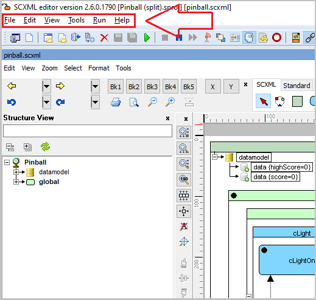
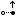
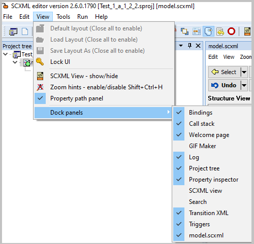
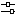

<a name="top-anchor"/>

| [Contents](../README.md#table-of-contents) | [SCXML Wiki](https://alexzhornyak.github.io/SCXML-tutorial/) | [Forum](https://github.com/alexzhornyak/ScxmlEditor-Tutorial/discussions) |
|---|---|---|

# Main Menu

## File
<!-- Object: File1 -->
Contains file-related operations for managing projects and units in the [SCXML editor](../README.md#editing-scxml-charts).

### New Project
 
Creates a new SCXML [project](../README.md#creating-a-project).

**Shortcut**: `Ctrl+N`  
<!-- Object: Newproject1 | Shortcut: 16462 = 16384 (Ctrl) + 78 (N) -->
<!-- Action: actNewProj -->

### New Unit
 
Creates a new SCXML [unit](../README.md#creating-a-unit).

**Shortcut**: `Shift+Ctrl+N`  
<!-- Object: NewUnit1 | Shortcut: 24654 = 24576 (Shift+Ctrl) + 78 (N) -->
<!-- Action: actNewUnit -->

### Open Project
 
Openes an existing SCXML [project](../README.md#creating-a-project).

**Shortcut**: `Ctrl+O`  
<!-- Object: Open3 | Shortcut: 16463 = 16384 (Ctrl) + 79 (O) -->
<!-- Action: actOpenProject -->

### Open Unit
 
Opens an existing SCXML [unit](../README.md#creating-a-unit).

**Shortcut**: `Shift+Ctrl+O`  
<!-- Object: Openunit1 | Shortcut: 24655 = 24576 (Shift+Ctrl) + 79 (O) -->
<!-- Action: actOpenUnit -->

### Build
 
[Builds an active SCXML project](ProjectBuild.md).

**Shortcut**: `Ctrl+B`  
<!-- Object: Build2 | Shortcut: 16450 = 16384 (Ctrl) + 66 (B) -->
<!-- Action: actBuildProject -->

### Add Unit
 
Adds a new unit to the active project.

<!-- Object: AddUnit1 -->
<!-- Action: actAddUnit -->

### Add Existing Unit
 
Adds an existing unit to the active project.
<!-- Object: AddExistingUnit1 -->
<!-- Action: actAddExisting -->

### Remove Unit
 
Removes unit from the active project.
<!-- Object: Removeunit1 -->
<!-- Action: actRemoveUnit -->

### Close
 
Closes active unit editor.

**Shortcut**: `Ctrl+W`  
<!-- Object: Close2 | Shortcut: 16471 = 16384 (Ctrl) + 87 (W) -->
<!-- Action: actClose -->

### Close All
 
Closes all (project and units).

**Shortcut**: `Shift+Ctrl+W`  
<!-- Object: ActionCloseProject1 | Shortcut: 24663 = 24576 (Shift+Ctrl) + 87 (W) -->
<!-- Action: actCloseAll -->

### Revert
Cancel all modifications that were made in the opened unit or project.
 

**Shortcut**: `Shift+Alt+W`  
<!-- Object: Revert1 | Shortcut: 41047 = 40960 (Shift+Alt) + 87 (W) -->
<!-- Action: actRevert -->

### Save Project As...
 
Saves project with the new file name.
<!-- Object: SaveProjectAs1 -->
<!-- Action: actSaveProjectAs -->

### Save Unit
 
Apply all modifications and saves the unit.

> **NOTE:** Save unit action is not active if you there are no modifications. If you want to save it anyway, use [Force Save Unit](#force-save-all-opened) option.

**Shortcut**: `Ctrl+S`  
<!-- Object: Save1 | Shortcut: 16467 = 16384 (Ctrl) + 83 (S) -->
<!-- Action: actSave -->

### Save Unit As...
 
Saves unit with the new file name.
<!-- Object: SaveAs1 -->
<!-- Action: actSaveAs -->

### Save All
 
Saves all modification in all opened project and units.

**Shortcut**: `Shift+Ctrl+S`  
<!-- Object: Open2 | Shortcut: 24659 = 24576 (Shift+Ctrl) + 83 (S) -->
<!-- Action: actSaveAll -->

### Force Save All Opened
 
Saves all opened files and project even if there are no modifications.  
<!-- Object: ForceSaveAllOpened -->
<!-- Action: actForceSaveAllOpened -->

### Force Save All
 
Saves all files and project even if it seems to have no changes.
<!-- Object: ForceSaveAll -->
<!-- Action: actForceSaveAll -->

### Save flat
 
Saves all nested state machines and data sources into [single file](ProjectBuild.md#example).
<!-- Object: Saveflat1 -->
<!-- Action: actSaveFlat -->

### Import states configuration
 
Opens active states configuration and highlight them in the chart.
<!-- Object: Importstatesconfiguration1 -->
<!-- Action: actImportConfiguration -->

### Export
<!-- Object: Export1 -->
Provides options to export the SCXML project in various formats.

#### Export as raw scxml
<!-- Object: Exporttorawscxml1 -->
Exports as raw scxml without comments and metainformation.
<!-- Action: actExportToRawScxml -->

#### Export as HPP
<!-- Object: ExporttoHPP1 -->
Exports as C++ header, ready to be taken as string resource.
<!-- Action: actExportToHPP -->

#### Export as DFM
<!-- Object: ExporttoPas1 -->
Exports in Delphi Form Format, ready to be parsed for extracting all visual metainformation. 
<!-- Action: actExportToDFM -->

#### Export as ANSI C
<!-- Object: ExportasANSIC1 -->
Transforms SCXML to ANSI C file.
<!-- Action: actExportAnsiC -->

#### Export using 'qscxmlc'
<!-- Object: Exportusingqscxmlc1 -->
Compiles SCXML by 'qscxmlc'.  
<!-- Action: actExportQt -->

#### Export as graph DOT
<!-- Object: ExportasgraphDOT1 -->
Exports in [Graphviz dot format](DotBasedAutoLayout.md).
<!-- Action: actExportGraphDot -->

#### Export as graph DOT + Png
<!-- Object: ExportasgraphDOTPng1 -->
Exports as [Graphviz DOT](DotBasedAutoLayout.md) + Png.
<!-- Action: actExportGraphDotPlusPng -->

#### Export as SVG
<!-- Object: ExportasSVG1 -->
Exports as [SVG file](ExportScxmlToSVG.md).  
<!-- Action: actExportSVG -->

#### Export as Qt Creator Scxml
<!-- Object: ExportasQtCreatorScxml1 -->
Saves file with [Qt Creator visual metainformation](ExportScxmlWithMetainformation.md#qt-creator).
<!-- Action: actExportAsQtCreatorScxml -->

#### Export as VSCode Scxml
Saves SCXML with [VSCode visual metainformation](ExportScxmlWithMetainformation.md#vscode).
<!-- Object: ExportasVSCodeScxml1 -->
<!-- Action: actExportAsVSCodeScxml -->

#### Export as ScxmlGui
<!-- Object: ExportasScxmlGui1 -->
Saves file with [ScxmlGui visual metainformation](ExportScxmlWithMetainformation.md#scxmlgui).
<!-- Action: actExportAsScxmlGui -->

#### Export as Simple Visual Scxml
Saves file with [simple visual metainformation](ExportScxmlWithMetainformation.md#simple-visual-metainformation-format).
<!-- Object: ExportasSimpleVisualScxml1 -->
<!-- Action: actExportAsSimpleScxml -->

## Edit
<!-- Object: MenuEdit -->
Contains editing and search-related operations.

### Search
 
Searches state or transition by matching a text in its properties.

**Shortcut**: `Ctrl+F`  
<!-- Object: Search1 | Shortcut: 16454 = 16384 (Ctrl) + 70 (F) -->
<!-- Action: actSearch -->

### Search All

Searches for all matches in state or transitions and preview them in special tab.

**Shortcut**: `Shift+Ctrl+F`  
<!-- Object: SearchAll1 | Shortcut: 24646 = 24576 (Shift+Ctrl) + 70 (F) -->
<!-- Action: actSearchAll -->

### Clear clipboard connections
 
Clears connections (transitions) that were previously copied to the clipboard. 
<!-- Object: Clearclipboardconnections1 -->
<!-- Action: actClearClipboardConnections -->

### Clear log
 
Clears active log list (it depends on what tab is selected: Debug or CMD Output).
<!-- Object: Clearlog2 -->
<!-- Action: actClearLog -->

### IDE Insight ...
 
[Live search through IDE](IDEInsight.md).

**Shortcut**: `Ctrl+.`  
<!-- Object: IDEInsight1 | Shortcut: 16574 = 16384 (Ctrl) + 190 (.) -->
<!-- Action: actIDEInsight -->

### Orthographic Splines (Auto Layout)
 
[Switches to the orthographic splines (Auto Layout)](DotBasedAutoLayout.md).
<!-- Object: OrthographicSplinesAutoLayout1 -->
<!-- Action: actAutoLayoutOrthoSplines -->

### Polyline Splines (Auto Layout)
 
[Switches to the polyline splines (Auto Layout)](DotBasedAutoLayout.md).
<!-- Object: PolylineSplinesAutoLayout1 -->
<!-- Action: actAutoLayoutPolySplines -->

## View
<!-- Object: View -->
Contains options for managing the UI layout and visibility of panels.

### Default layout
 
Applies default panels layout.
<!-- Object: Defaultlayout1 -->
<!-- Action: actDefaultLayout -->

### Load Layout
 
Loads panels layout from file.
<!-- Object: Loadlayout1 -->
<!-- Action: actLoadLayout -->

### Save Layout As
 
Saves panel layout to file.
<!-- Object: Savelayoutas1 -->
<!-- Action: actSaveLayout -->

### Lock UI
 
Locks UI for undocking.
<!-- Object: LockUI1 -->
<!-- Action: actLockDocking -->

### SCXML View - show/hide
 
Toggles visibility of [SCXML View panel](LiveScxmlEdit.md)
<!-- Object: Scxmlviewshowhide1 -->
<!-- Action: actDockPanelScxmlViewVisible -->

### Zoom Hints
 
Toggles zoom hints visibility.

**Shortcut**: `Shift+Ctrl+H`  
<!-- Object: MenuZoomHintsEnabled | Shortcut: 24648 = 24576 (Shift+Ctrl) + 72 (H) -->
<!-- Action: actEnableZoomHints -->

### Property path panel
Toggles visibility of [the property inspector filter panel](PropertyInspector.md#filter-panel).
<!-- Object: Propertypathpanel2 -->
<!-- Action: actPanelPropPath -->

### Dock panels
Contains menu items to toggle visibility of docking panels.

<!-- Object: MenuDockpanels -->

## Tools
<!-- Object: MenuTools -->
Contains utility and configuration tools.

### Project Options
 
Openes active project options.
<!-- Object: PropjectOptions1 -->
<!-- Action: actOptions -->

### Application settings
 
Openes application settings.
<!-- Object: Applicationsettings1 -->
<!-- Action: actAppSettings -->

### Presets
<!-- Object: MenuPresets -->
Provides preset configurations for SCXML projects.  

#### Condition
 
<!-- Object: WizardCondition1 -->
<!-- Action: actPresetsCondition -->

#### On-Off
 
<!-- Object: OnOff1 -->
<!-- Action: actPresetsOnOff -->

### Get Mouse Position
 
Copies cursor position to the clipboard and prints it in the log panel.

**Shortcut**: `Shift+Ctrl+F6`  
<!-- Object: GetMousePos1 | Shortcut: 24693 = 24576 (Shift+Ctrl) + 117 (F6) -->
<!-- Action: actGetScreenCursorCoordinates -->

### Test regular expression
 
Validates a regular expression for the usage in watch shapes, etc.
<!-- Object: estregularexpression1 -->
<!-- Action: actRegExpDialog -->

### Register SCXML file extensions
Associate `.scxml` and `.sproj` extensions with [Scxml Editor](../README.md) application.
<!-- Object: RegisterSCXMLprojectandunitfileextensions1 -->
<!-- Action: actRegisterScxmlFiles -->

### Text editor
 
Openes panel with text editor.
<!-- Object: exteditor1 -->
<!-- Action: actShowTextEditor -->

## Run
<!-- Object: MenuRun -->
Contains options for running and debugging SCXML projects.

### Build
 
[Builds an active project](ProjectBuild.md).

**Shortcut**: `Ctrl+B`  
<!-- Object: Build1 | Shortcut: 16450 = 16384 (Ctrl) + 66 (B) -->
<!-- Action: actBuildProject -->

### Run
 
Runs special unit for testing if a flag 'Root For Run and Build' is set otherwise runs the current active unit.

**Shortcut**: `F9`  
<!-- Object: Run1 | Shortcut: 120 = 120 (F9) -->
<!-- Action: actRun -->

### Pause
 
Pauses the highlighting of the states and transitions during debug.

> **NOTE**: If 'Pause' is active then StateMachine will be stopped on every 'AfterEnter' action.

**Shortcut**: `F10`  
<!-- Object: actPause1 | Shortcut: 121 = 121 (F10) -->
<!-- Action: actPause -->

### Stop
 
Stops execution of the state machine.
<!-- Object: Stop1 -->
<!-- Action: actStop -->

### Next step
 
If there is a debug message queue, this action passes the next message and pops it.

**Shortcut**: `F11`  
<!-- Object: Nextstep1 | Shortcut: 122 = 122 (F11) -->
<!-- Action: actNextStep -->

### Sync Invoked
If there are invoked machines, synchronize entered-exited events inside of them.
<!-- Object: SyncInvoked1 -->
<!-- Action: actSyncInvoked -->

### Test Coverage
 
When its on, the highlighted states and transitions are not cleared during a run.
<!-- Object: estCoverage1 -->
<!-- Action: actTestCoverage -->

### Start listening from external application
 
Starts listening from external application in the format described [here](DebugScxmlStateCharts.md).
<!-- Object: Startlisteningfromexternaltester1 -->
<!-- Action: actExternTesting -->

### Scroll chart to view shape
 
Scrolles chart to view shape in testing mode.  
<!-- Object: Scrollcharttoviewshape1 -->
<!-- Action: actShapeScrollToView -->

### Set panel foreground
 
Sets unit foreground in testing mode  
<!-- Object: Setpanelforeground1 -->
<!-- Action: actSetPanelForeground -->

### Clear all stack items
 
Clears all items in the Callstack View.
<!-- Object: Clearallstackitems2 -->
<!-- Action: actStackClear -->

### Clear entered states
 
Clears all entered states of active editor panel.
<!-- Object: Clearenteredstates1 -->
<!-- Action: actClearEnteredStates -->

### Clear all breakpoints
 
Clears all debug breakpoints.
<!-- Object: Clearallbreakpoints1 -->
<!-- Action: actClearAllBreakpoints -->

## Help
<!-- Object: Help1 -->
Provides access to help resources and documentation.

### Hotkeys
Shows the list of all available hotkeys.
<!-- Object: Hotkeys1 -->

### Quick help (datamodel 'luavia')
Shows help for 'luavia' datamodel.
<!-- Object: MenuLuaviaHelp -->

### Documentation
Openes the website with the current documentation.
<!-- Object: Documentation1 -->

| [TOP](#top-anchor) | [Contents](../README.md#table-of-contents) | [SCXML Wiki](https://alexzhornyak.github.io/SCXML-tutorial/) | [Forum](https://github.com/alexzhornyak/ScxmlEditor-Tutorial/discussions) |
|---|---|---|---|
