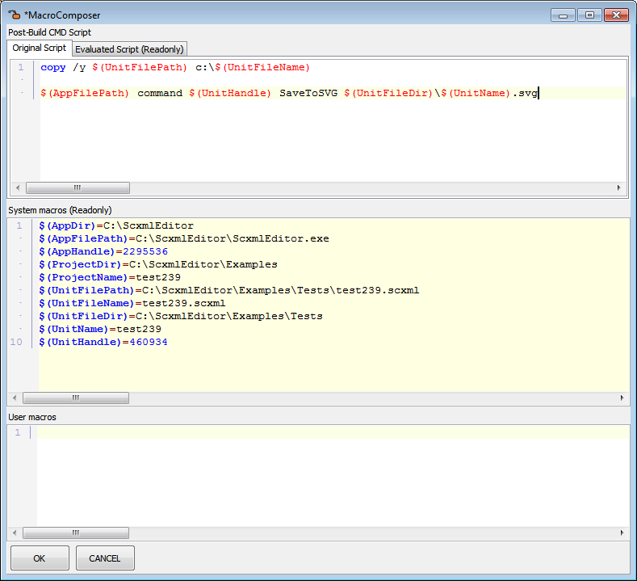

<a name="top-anchor"/>

| [Contents](../README.md#table-of-contents) | [SCXML Wiki](https://alexzhornyak.github.io/SCXML-tutorial/) | [Forum](https://github.com/alexzhornyak/ScxmlEditor-Tutorial/discussions) |
|---|---|---|

# Project Tree
Displays and organizes the contents of your current scxml project and any scxml files it contains. You can perform many important project management tasks, such as adding, removing scxml files, etc. The default location of the Projects window is the upper right corner of the IDE, but the window is dockable and you may dock it to any other place you wish.


# Nodes and Items in the Project Tree
The contents of the current project are represented by a tree structure in the Project Tree window. The various nodes and items in the tree structure are indicated by icons and labels.

## Root node
Is marked with the green circle. This file is used as the initial file for testing applications when **Run** command is performed and as a target file for [project build command](ProjectBuild.md)


## Scxml Project Context Menu
Right-click a project file to display the context menu commands.


## Scxml Unit Context Menu
Right-click a scxml file to display the context menu commands.


## Post Save Unit Actions
It is available to execute post save cmd script after the scxml unit file was saved

> NOTE: This option is available only in project mode!

1. Select a unit in Project Tree
2. Call **`Edit Post Save`** menu item


3. Edit post save script



### Post Save Unit Commands
Commands that could be executed by state machine chart editor

**Format:**

```batch
$(AppFilePath) command [Unit HWND] [Command] [Arg1|Arg2|Arg3]
```

**Example:**

```batch
$(AppFilePath) command $(UnitHandle) SaveToSVG $(UnitFileDir)\$(UnitName).svg
```

| Command | Arguments | Description |
|---|---|---|
| SaveToSVG | Arg1=FileName | Saves state chart to SVG |
| SaveRawScxmlToFile | Arg1=FileName | Saves state chart to scxml without comments and metainformation |
| SaveRawScxmlToHPP | Arg1=FileName | Saves state chart to scxml without comments and metainformation as C++ Header |
| SaveScxmlToPas | Arg1=FileName | Saves state chart to DFM file |
| SaveToDot | Arg1=FileName | Saves state chart to Graphviz DOT file |
| SaveToDotPlusPng | Arg1=FileName | Saves state chart to Graphviz DOT and PNG files |
| SaveToBMP | Arg1=FileName | Saves state chart to BMP file |
| SaveToPNG | Arg1=FileName | Saves state chart to PNG file |
| SaveToQtCreatorScxml | Arg1=FileName | Saves state chart with Qt Creator graphical metainformation |
| SaveToVSCodeScxml | Arg1=FileName | Saves state chart with VSCode graphical metainformation |
| SaveToScxmlGui | Arg1=FileName | Saves state chart with ScxmlGui graphical metainformation |
| SaveToSimpleScxml | Arg1=FileName | Saves state chart with Simple Visual graphical metainformation |

### Post Save Application Commands
Commands that could be executed by ScxmlEditor application

**Format:**

```batch
$(AppFilePath) command [App HWND] [Command] [Arg1|Arg2|Arg3]
```

**Example:**

```batch
$(AppFilePath) command $(AppHandle) SwitchLog Debug False
```

| Command | Arguments | Description |
|---|---|---|
| SwitchLog | Arg1=Debug| Switches Log tab to Debug output |
|  | Arg1=CMD | Switches Log tab to CMD output |
|  | Arg2=True,False (Bool) | Clear output or not |


| [TOP](#top-anchor) | [Contents](../README.md#table-of-contents) | [SCXML Wiki](https://alexzhornyak.github.io/SCXML-tutorial/) | [Forum](https://github.com/alexzhornyak/ScxmlEditor-Tutorial/discussions) |
|---|---|---|---|
