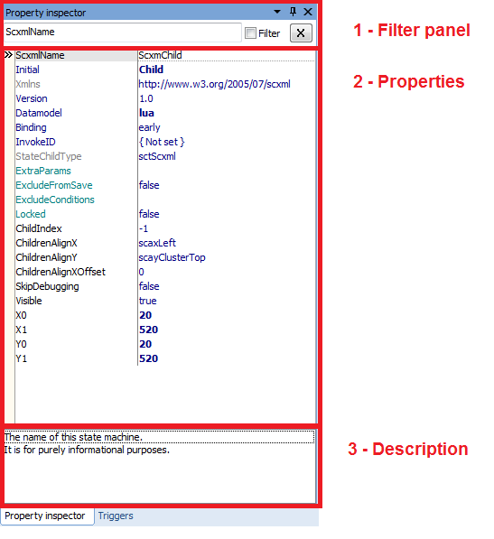
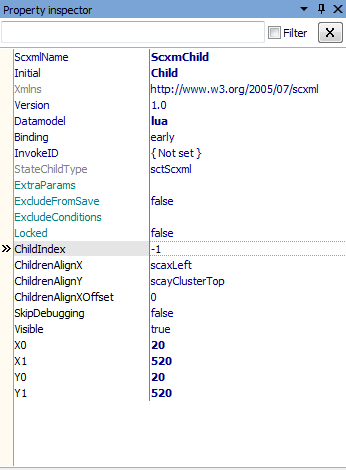
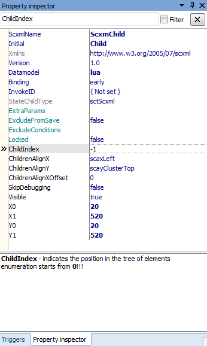

<a name="top-anchor"/>

| [Contents](../README.md#table-of-contents) | [SCXML Wiki](https://alexzhornyak.github.io/SCXML-tutorial/) | [Forum](https://github.com/alexzhornyak/ScxmlEditor-Tutorial/discussions) |
|---|---|---|

# Property Inspector
Is used to edit and examine the properties of the currently selected states, executable contents and transitions

## Filter panel
Check **Filter** CheckBox and type the name of property that you want to filter. Use wildcard if you want to filter a group of properties

## Properties
The Properties panel of the Property Inspector enables you to set properties for states, contents or transitions on your chart.

| [TOP](#top-anchor) | [Contents](../README.md#table-of-contents) | [SCXML Wiki](https://alexzhornyak.github.io/SCXML-tutorial/) | [Forum](https://github.com/alexzhornyak/ScxmlEditor-Tutorial/discussions) |
|---|---|---|---|
