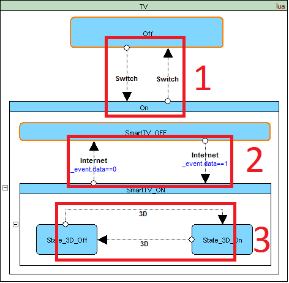
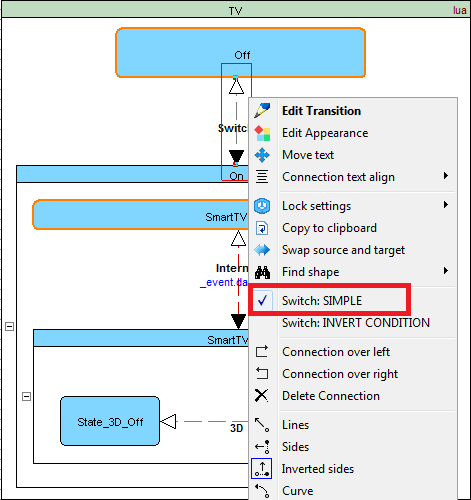
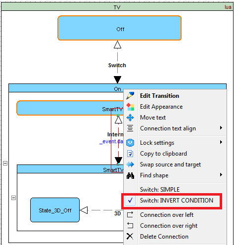
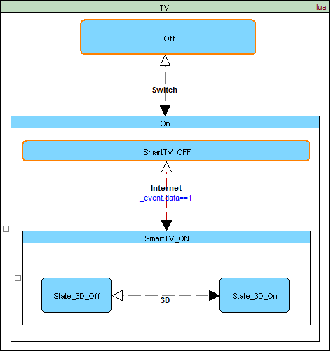
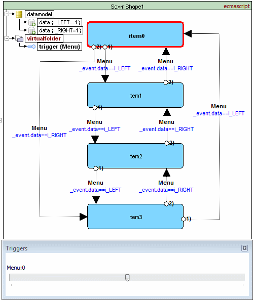

<a name="top-anchor"/>

| [Contents](../README.md#table-of-contents) | [SCXML Wiki](https://alexzhornyak.github.io/SCXML-tutorial/) | [Forum](https://github.com/alexzhornyak/ScxmlEditor-Tutorial/discussions) |
|---|---|---|

# Smart Switch [Transitions](https://alexzhornyak.github.io/SCXML-tutorial/Doc/transition.html)

There are some cases when 2 shapes are connected with [transitions](https://alexzhornyak.github.io/SCXML-tutorial/Doc/transition.html) that work as **switch**. Let's take a look at the picture below.



## Simple Switch
Transition groups 1 and 3 are simple switches. They have no conditions and just make a transition by same event.
If we redesign a chart we should always move 2 transitions.
So we offer to implement 1 visual transition which will produce the same code in the resulting SCXML as if there were 2 standard ones.



## Switch With Inverted Condition
Transition group 2 is transition with the same event name but 2 conditions that have boolean inverted logic. So,

  `_event.data==1 and _event.data==0`
  
could be presented as

  `_event.data==1 and not(_event.data==1)`

And we offer to implement 1 visual transition that will produce such inversion defined for specific programming language.



## Output


```xml
<scxml datamodel="lua" initial="Off" name="TV" version="1.0" xmlns="http://www.w3.org/2005/07/scxml">
	<state id="Off">
		<transition event="Switch" target="On"/>
	</state>
	<state id="On" initial="SmartTV_OFF">
		<transition event="Switch" target="Off"/>
		<state id="SmartTV_OFF">
			<transition cond="_event.data==1" event="Internet" target="SmartTV_ON"/>
		</state>
		<state id="SmartTV_ON">
			<transition cond="not (_event.data==1)" event="Internet" target="SmartTV_OFF"/>
			<state id="State_3D_Off">
				<transition event="3D" target="State_3D_On"/>
			</state>
			<state id="State_3D_On">
				<transition event="3D" target="State_3D_Off"/>
			</state>
		</state>
	</state>
</scxml>
```

## Option to override Inverted Condition (Since ScxmlEditor 2.2.2)
Suppose that you flow between two states by different conditions which are not related and boolean expression can not be applied



Since ScxmlEditor 2.2.2 there is an option to override back condition:
- Select condition on the chart
- Select menu 'ConditionBack' in Property Inspector
- Set desired condition value for going back


> Now all visual transitions are reduced by 2 times and chart becomes more tiny


| [TOP](#top-anchor) | [Contents](../README.md#table-of-contents) | [SCXML Wiki](https://alexzhornyak.github.io/SCXML-tutorial/) | [Forum](https://github.com/alexzhornyak/ScxmlEditor-Tutorial/discussions) |
|---|---|---|---|
