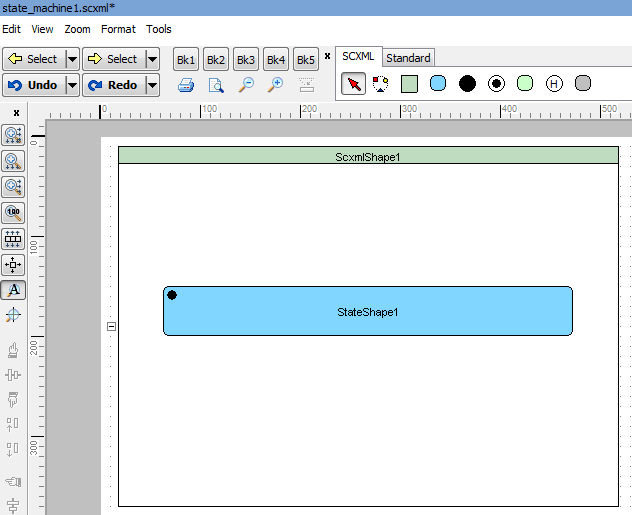
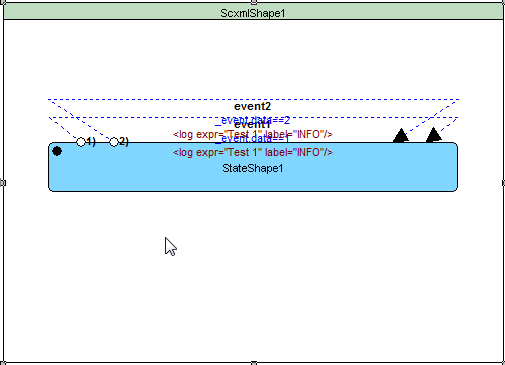
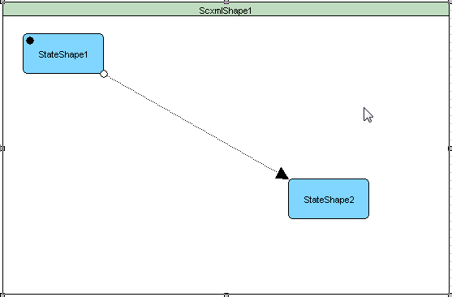

<a name="top-anchor"/>

| [Contents](../README.md#table-of-contents) | [SCXML Wiki](https://alexzhornyak.github.io/SCXML-tutorial/) | [Forum](https://github.com/alexzhornyak/ScxmlEditor-Tutorial/discussions) |
|---|---|---|

# Transitions (Connections)
[Transitions](https://alexzhornyak.github.io/SCXML-tutorial/Doc/transition.html) define how a [state](https://alexzhornyak.github.io/SCXML-tutorial/Doc/state.html) reacts to events that are generated either by the state machine or external entities. When events occur, the state machine checks for a matching transition defined in the active state and moves to its target state.

## Transitions between states
### Creation
#### 1. Press 'Connect button'

#### 2. Press 'Ctrl+Right Mouse Button'

### Visual types
* **Lines**

* **Square (IN: Top|Bottom)**

* **Square (IN: Left|Right)**

* **Curve**

* **Connection over Left | Top | Right | Bottom**

## Self Transitions (Connections)
A self transition is a transition that starts and ends in the same state.
### How to create:
* select state and press **'Make Self-connection'** button in **'Tools (Bookmarks)'** panel
* select state, right-click to call context menu and hit menu item **'Make Self-connection'**

### Arrange Self Transitions (Connections)
Multiple self transitions may be quickly arranged by pressing **'Arrange Self-connections'** menu item. Primary left and right coordinates for transitions are defined by **the first transition**

## Delayed transition
A delayed transition is a transition that happens after a period of time, specifically being in a specific state for a certain amount of time.

Delayed transitions are not part of [SCXML]((https://alexzhornyak.github.io/SCXML-tutorial/)).  Instead, you have to specify to send a delayed event, and a normal transition that handles that event. The delayed event must be given a name, and also a unique identifier (in order to cancel the delayed event).

| [TOP](#top-anchor) | [Contents](../README.md#table-of-contents) | [SCXML Wiki](https://alexzhornyak.github.io/SCXML-tutorial/) | [Forum](https://github.com/alexzhornyak/ScxmlEditor-Tutorial/discussions) |
|---|---|---|---|
