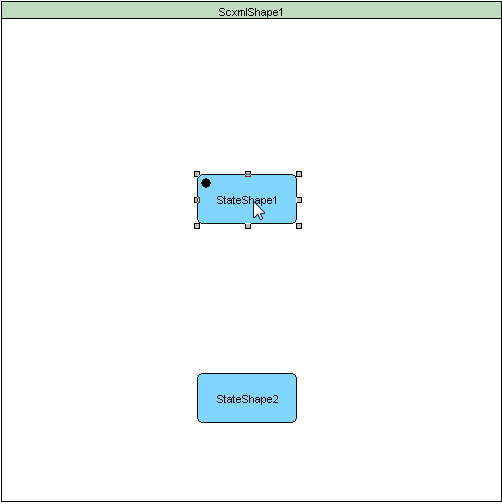

<a name="top-anchor"/>

| [Contents](../README.md#table-of-contents) | [SCXML Wiki](https://alexzhornyak.github.io/SCXML-tutorial/) | [Forum](https://github.com/alexzhornyak/ScxmlEditor-Tutorial/discussions) |
|---|---|---|

# Transitions (Connections)
[Transitions](https://alexzhornyak.github.io/SCXML-tutorial/Doc/transition.html) define how a [state](https://alexzhornyak.github.io/SCXML-tutorial/Doc/state.html) reacts to events that are generated either by the state machine or external entities. When events occur, the state machine checks for a matching transition defined in the active state and moves to its target state.

## Transitions between states
### Creation
#### 1. Press 'Connect button'

#### 2. Press 'Ctrl+Right Mouse Button'

### Visual types
* **Lines**  

* **Square (IN: Top|Bottom)**  

* **Square (IN: Left|Right)**  

* **Curve**  

* **Connection over Left | Top | Right | Bottom**  

## Self Transitions

| [TOP](#top-anchor) | [Contents](../README.md#table-of-contents) | [SCXML Wiki](https://alexzhornyak.github.io/SCXML-tutorial/) | [Forum](https://github.com/alexzhornyak/ScxmlEditor-Tutorial/discussions) |
|---|---|---|---|
