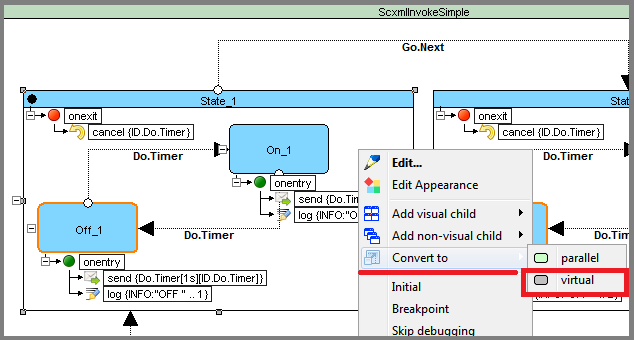
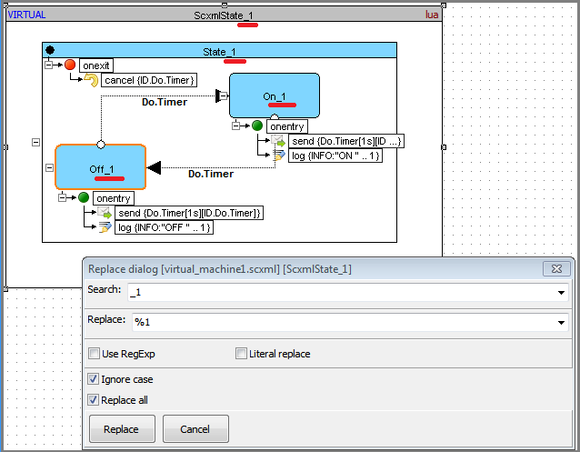
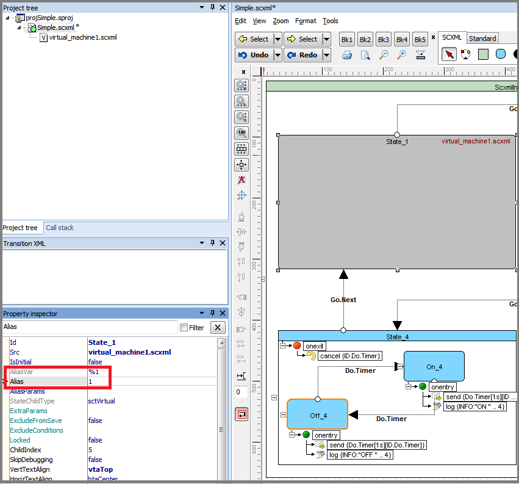
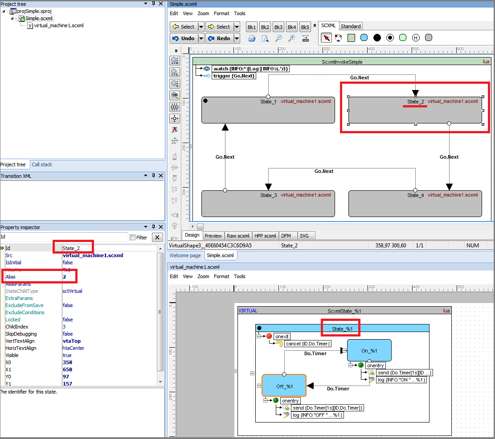
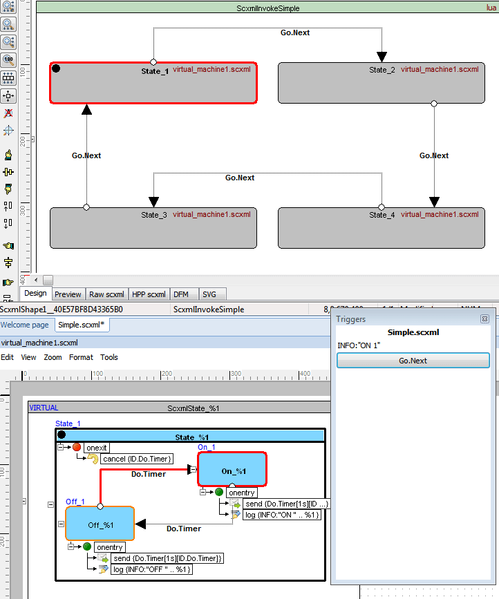

<a name="top-anchor"/>

| [Contents](../README.md#table-of-contents) | [SCXML Wiki](https://alexzhornyak.github.io/SCXML-tutorial/) | [Forum](https://github.com/alexzhornyak/ScxmlEditor-Tutorial/discussions) |
|---|---|---|

# How to split State Chart without using [\<invoke\>](https://alexzhornyak.github.io/SCXML-tutorial/Doc/invoke.html)

SCXML has an option to split state machine into sub state machines using [\<invoke\>](https://alexzhornyak.github.io/SCXML-tutorial/Doc/invoke.html) element. But in this case we need to provide [data](https://alexzhornyak.github.io/SCXML-tutorial/Doc/datamodel.html) sharing between all parts.
This procedure in some cases may be redundant or complex. And not all SCXML SDKs support such feature.
But what to do if state chart becomes too large and difficult to read?

Let's take a look at [QT pinball state chart example](https://doc.qt.io/qt-5/qtscxml-pinball-example.html)


We see that state **global** could be splitted into **guiControl** and **internalState**

## Converting states to virtual sub states
Select state that you wish to make virtual, press right mouse button and select in the popup-menu **Convert To->Virtual**


This operation will create virtual state machine unit and move selected state machine logic to the new one


Save the unit with the corresponding name.
We recommend to give prefix like **include_** or **virtual_** for better understanding of project unit roles.


Do the same procedures for other units you'd like to make virtual


Also save the new virtual unit and give the same prefix


After splitting you may reduce the width and height of virtual state chart shapes


## Splitting of virtual units
Procedures for splitting virtual units are the same as procedures made for root state machine


After splitting virtual unit will be marked. And nested virtual state chart shapes will have a links to the corresponding virtual units.


## Adding onentry, onexit, datamodel and invoke to virtual states
**Since [ScxmlEditor 2.1.9](../README.md)** it is available to add [onentry](https://alexzhornyak.github.io/SCXML-tutorial/Doc/onentry.html), [onexit](https://alexzhornyak.github.io/SCXML-tutorial/Doc/onexit.html), [datamodel](https://alexzhornyak.github.io/SCXML-tutorial/Doc/datamodel.html) and [invoke](https://alexzhornyak.github.io/SCXML-tutorial/Doc/invoke.html) either to virtual state or to referenced state on splitted chart


## Debugging
Set SCXML unit which will be as root


Choose layout that will be more suitable for you during debugging


After run all entered states will be highlighted


You may double click on virtual shape to switch to the its source unit


## Virtual Invoke
Since ScxmlEditor 2.5 there is an option to include state chart parts multiple times

**Inspired by discussion how could we avoid [invoke](https://alexzhornyak.github.io/SCXML-tutorial/Doc/invoke.html) element in systems that do not support it:**


**Let's take a look at the next example:**


The principle is based on the fact that we find repeated prefixes in the state identifiers or other scxml attributes such as data identifiers or values. According to scxml standard we can not use states with the same names in one scxml chart, so we will use Alias which is filled with value assigned in parent Virtual State.

1. Convert **`State_1`** to Virtual State
   


2. Replace state identifiers with Alias variable **`%1`**
   


3. Set Virtual State Alias
   


4. Set Aliases to other virtual states



### Result
ScxmlEditor will perform substition of Alias variable **`%1`** to Alias value which is set in Virtual State. So in target scxml file you will get different state identifiers

```xml
<state id="State_1" initial="Off_1">
...
<state id="State_2" initial="Off_2">
...
<state id="State_3" initial="Off_3">
...
<state id="State_4" initial="Off_4">
    <onexit>
        <cancel sendid="ID.Do.Timer"/>
    </onexit>
    <state id="Off_4">
        <onentry>
            <send delay="1s" event="Do.Timer" id="ID.Do.Timer"/>
            <log expr="&quot;OFF &quot; .. 4" label="INFO"/>
        </onentry>
        <transition event="Do.Timer" target="On_4" type="external"/>
    </state>
    <state id="On_4">
        <onentry>
            <send delay="1s" event="Do.Timer" id="ID.Do.Timer"/>
            <log expr="&quot;ON &quot; .. 4" label="INFO"/>
        </onentry>
        <transition event="Do.Timer" target="Off_4" type="external"/>
    </state>
    <transition event="Go.Next" target="State_3" type="external"/>
</state>
```

|  |
|---|
| |

| [TOP](#top-anchor) | [Contents](../README.md#table-of-contents) | [SCXML Wiki](https://alexzhornyak.github.io/SCXML-tutorial/) | [Forum](https://github.com/alexzhornyak/ScxmlEditor-Tutorial/discussions) |
|---|---|---|---|
