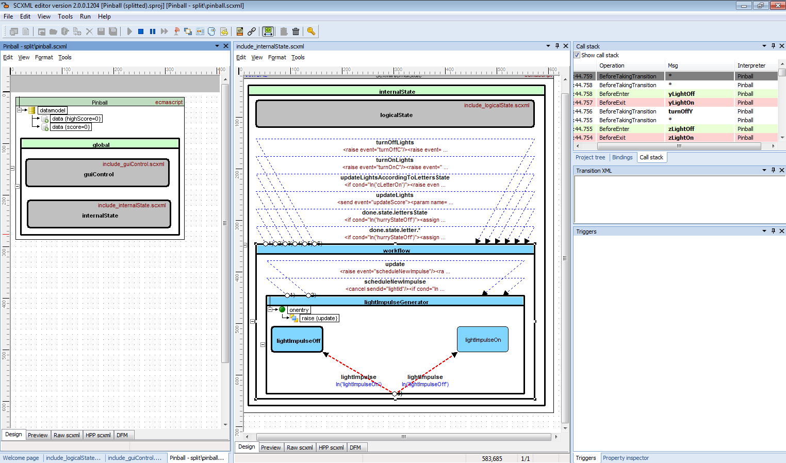

<a name="top-anchor"/>

| [Contents](../README.md#table-of-contents) | [SCXML Wiki](https://alexzhornyak.github.io/SCXML-tutorial/) | [Forum](https://github.com/alexzhornyak/ScxmlEditor-Tutorial/discussions) |
|---|---|---|

# How to split State Chart without using [\<invoke\>](https://alexzhornyak.github.io/SCXML-tutorial/Doc/invoke.html)

SCXML has an option to split state machine into sub state machines using [\<invoke\>](https://alexzhornyak.github.io/SCXML-tutorial/Doc/invoke.html) element. But in this case we need to provide [data](https://alexzhornyak.github.io/SCXML-tutorial/Doc/datamodel.html) sharing between all parts.
This procedure in some cases may be redundant or complex. And not all SCXML SDKs support such feature.
But what to do if state chart becomes too large and difficult to read?

Let's take a look at [QT pinball state chart example](https://doc.qt.io/qt-5/qtscxml-pinball-example.html)

We see that state **global** could be splitted into **guiControl** and **internalState**

## Converting states to virtual sub states
Select state that you wish to make virtual, press right mouse button and select in the popup-menu **Convert To->Virtual**

This operation will create virtual state machine unit and move selected state machine logic to the new one

Save the unit with the corresponding name.
We recommend to give prefix like **include_** or **virtual_** for better understanding of project unit roles.

Do the same procedures for other units you'd like to make virtual

Also save the new virtual unit and give the same prefix

After splitting you may reduce the width and height of virtual state chart shapes

## Splitting of virtual units
Procedures for splitting virtual units are the same as procedures made for root state machine

After splitting virtual unit will be marked. And nested virtual state chart shapes will have a links to the corresponding virtual units.

## Adding [onentry](https://alexzhornyak.github.io/SCXML-tutorial/Doc/onentry.html), [onexit](https://alexzhornyak.github.io/SCXML-tutorial/Doc/onexit.html), [datamodel](https://alexzhornyak.github.io/SCXML-tutorial/Doc/datamodel.html) and [invoke](https://alexzhornyak.github.io/SCXML-tutorial/Doc/invoke.html) to virtual states
**Since [ScxmlEditor 2.1.9](../README.md)** it is available to add [onentry](https://alexzhornyak.github.io/SCXML-tutorial/Doc/onentry.html), [onexit](https://alexzhornyak.github.io/SCXML-tutorial/Doc/onexit.html), [datamodel](https://alexzhornyak.github.io/SCXML-tutorial/Doc/datamodel.html) and [invoke](https://alexzhornyak.github.io/SCXML-tutorial/Doc/invoke.html) either to virtual state or to referenced state on splitted chart

## Debugging
Set SCXML unit which will be as root

Choose layout that will be more suitable for you during debugging

After run all entered states will be highlighted

You may double click on virtual shape to switch to the its source unit

| [TOP](#top-anchor) | [Contents](../README.md#table-of-contents) | [SCXML Wiki](https://alexzhornyak.github.io/SCXML-tutorial/) | [Forum](https://github.com/alexzhornyak/ScxmlEditor-Tutorial/discussions) |
|---|---|---|---|
