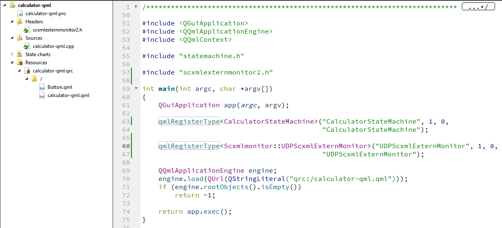
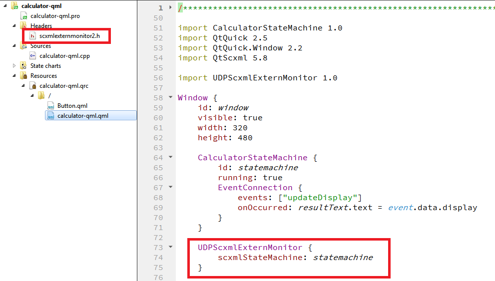
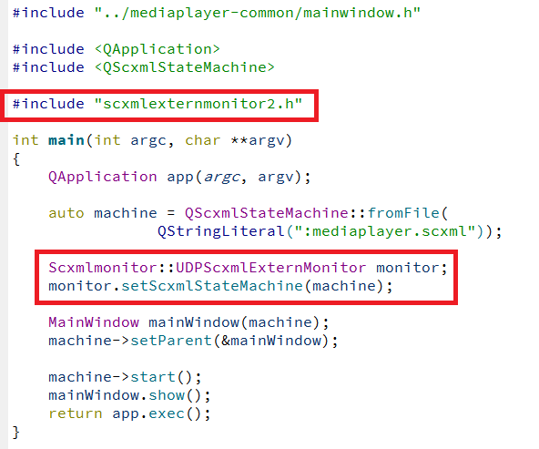
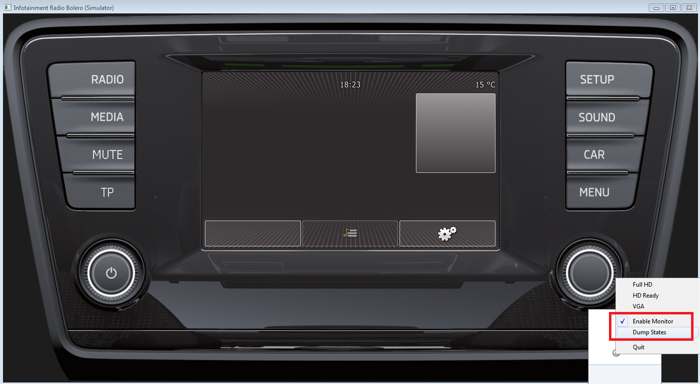
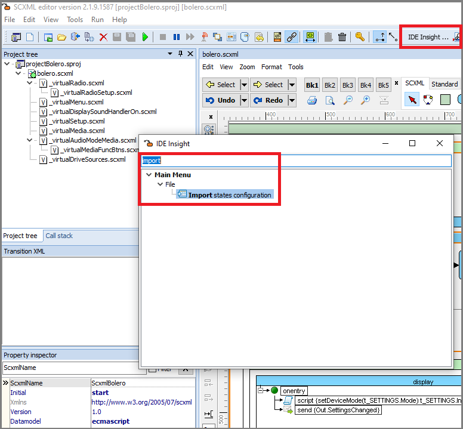
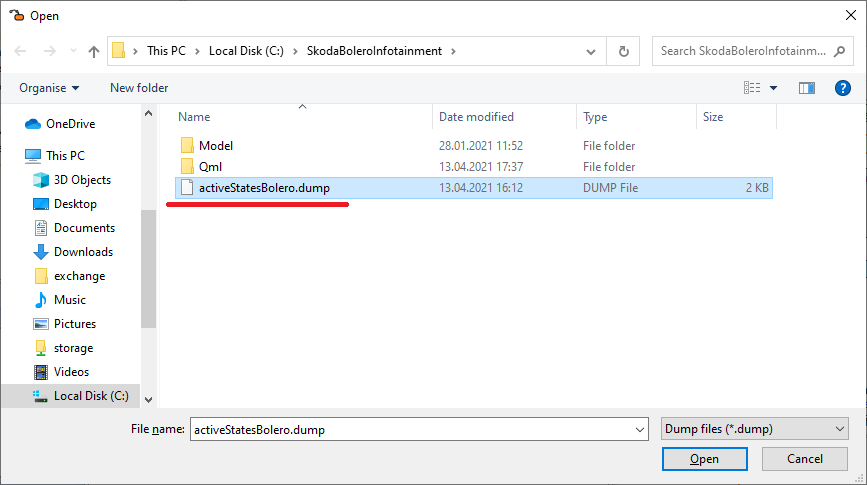
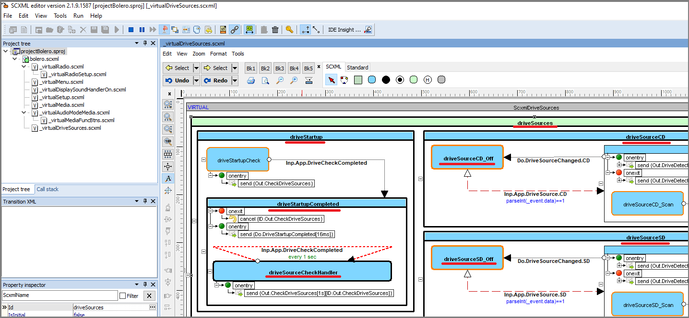

<a name="top-anchor"/>

| [SCXML Wiki](https://alexzhornyak.github.io/SCXML-tutorial/) | [Forum](https://github.com/alexzhornyak/ScxmlEditor-Tutorial/discussions) |
|---|---|

# Qt [SCXML](https://alexzhornyak.github.io/SCXML-tutorial/) External Debugging Monitor
Native QtCreator's scxml designer does not allow user to debug [SCXML statecharts](https://alexzhornyak.github.io/SCXML-tutorial/) and observe statemachine work flow, so we offer to use [ScxmlEditor](../README.md) as an instrument for debugging complex SCXML state charts

## Description
We implemented Qt SCXML monitor in a single header [ScxmlExternMonitor2.h](scxmlexternmonitor2.h) as **UDPScxmlExternMonitor**. It has public a property **`QScxmlStateMachine *scxmlStateMachine`**. While **scxmlStateMachine** is not assigned it does nothing and you may leave it even in a release versions of your applications. When you need to observe statemachine work flow, just assign a valid **QScxmlStateMachine pointer** to the property, and monitor will start send UDP debug packages to the ScxmlEditor. And you will be able to observe when state is entered and when is exited, etc.

## 1. Usage in QML
### 1.1. Option 1. From inherited state machine object

### 1.2. Option 2. From QML object
#### Monitor registration

#### Usage in QML

## 2. Usage in C++ Qt Widgets

## 3. Import active states configuration
There is an option to export and import active states configuration. It may be useful when you are unable to use a remote debugger. You can export active states configuration to file and open it later with ScxmlEditor **`Import states configuration`** menu option.
### Let's take a look at a simple example. 
Suppose that your deployed application does not work properly on the remote device.
- You can implement calling [**`IScxmlExternMonitor`** method **`QStringList dumpAllActiveStates()`**](scxmlexternmonitor2.h) into your application. And it will save active states configuration by demand.

- Later you can transfer dump file to your working place

- Open the corresponding project with ScxmlEditor

- Call menu **`Import states configuration`**

- Select dump file in dialog

- Analyze active states

| [TOP](#top-anchor) | [SCXML Wiki](https://alexzhornyak.github.io/SCXML-tutorial/) | [Forum](https://github.com/alexzhornyak/ScxmlEditor-Tutorial/discussions) |
|---|---|---|
