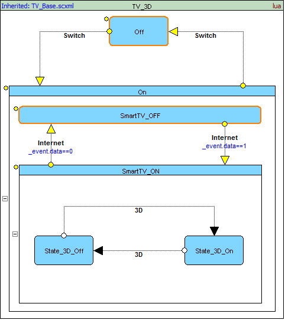
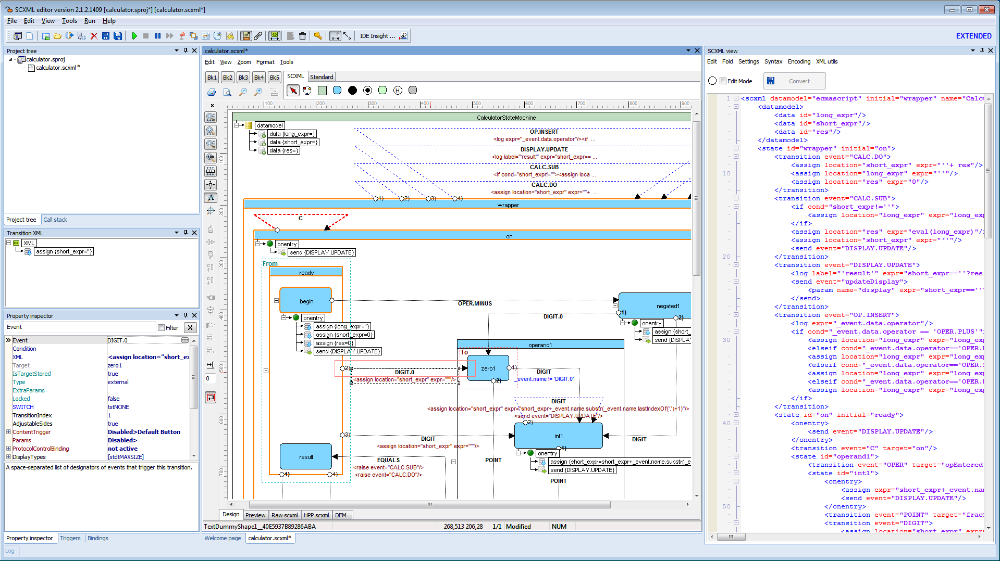
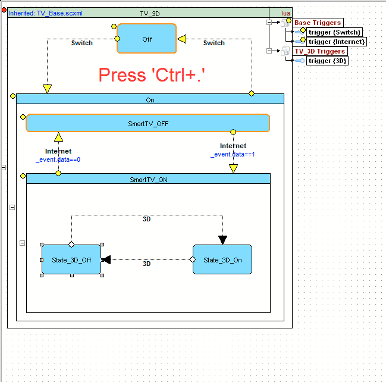
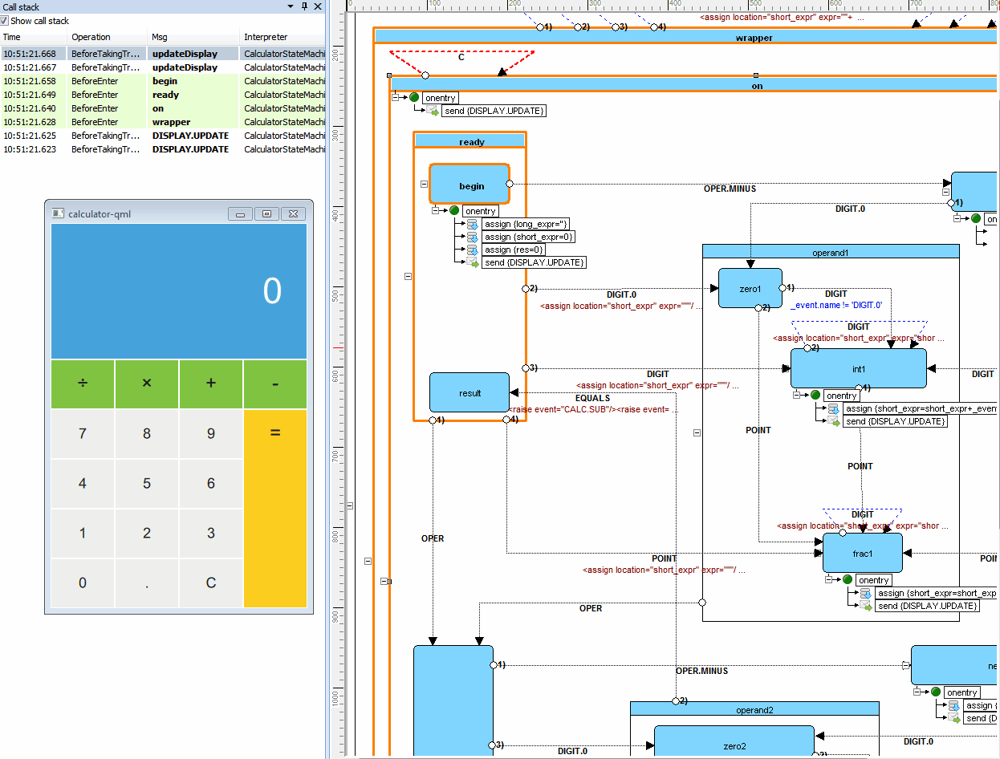

<a name="top-anchor"/>

| [Contents](#table-of-contents) | [SCXML Wiki](https://alexzhornyak.github.io/SCXML-tutorial/) | [SCXML Examples](https://alexzhornyak.github.io/SCXML-tutorial/Examples/) | [Forum](https://github.com/alexzhornyak/ScxmlEditor-Tutorial/discussions) |
|---|---|---|---|

**[Video overview - v.1.0](https://youtu.be/tL-NICRwggY)**

**[Video overview - v.2.0](https://youtu.be/SryLDwxcCjA)**

**[Video overview - v.2.1](https://youtu.be/h2CXPBAK_XY)**

# Scxml Editor 2.1.7
Powerful tool for creating, editing and debugging SCXML charts.

**New:** [IDE Insight](#new-ide-insight), [DOT-based autolayout](Doc/DotBasedAutoLayout.md#dot-based-auto-layout), [SCXML to DOT](Doc/DotBasedAutoLayout.md#how-to-convert-scxml-to-dot), [Inheritance](Doc/Inheritance.md), [visual chart splitting](Doc/VisualStateChartSplitting.md), [conditional project definitions](Doc/ConditionalDefines.md), GIF maker etc.
### Changelog
**2.1.7:** [SVG Export Settings](Doc/ExportScxmlToSVG.md#svg-export-settings)  
**2.1.6:** UScxmlTester with EcmaScript, In() predicate autocomplete, QtScxmlTester 5.9.1->5.15  
**2.1.5:** [Refactored Qt external debugger](Include/README.md)  
**2.1.4:** [Export SCXML to SVG](Doc/ExportScxmlToSVG.md), [Structure View](Doc/ScxmlStructureView.md)

## System requirments
Windows 7, 8, 10

! **ScxmlEditor\vcredist_x86.exe** must be installed for **UscxmlTester**, **Graphviz** and other components !  
! **ScxmlEditor\QtScxmlTester\vcredist_x64.exe** must be installed for **QtScxmlTester** !

You can find portable version **[here](https://www.dropbox.com/sh/fjzm9ejdrtra1c0/AAB_ASgIPRFLX57x7rWPEv3Ta?dl=0)**

[Zip Link](https://www.dropbox.com/s/1sx8p8o1e4t55hj/ScxmlEditor.zip?dl=0)

Latest version: **[2.1.7.1537](https://www.dropbox.com/sh/fjzm9ejdrtra1c0/AAB_ASgIPRFLX57x7rWPEv3Ta?dl=0)**

## Table of contents
[1. Inheritance](Doc/Inheritance.md)

[2. Conditional Project Definitions](Doc/ConditionalDefines.md)

[3. Smart Switch Transitions](Doc/SmartSwitchTransitions.md)

[4. Building a Project](Doc/ProjectBuild.md)

[5. Visual State Chart Splitting](Doc/VisualStateChartSplitting.md)

[6. DOT-based autolayout](Doc/DotBasedAutoLayout.md#dot-based-auto-layout)

[7. Convert SCXML to DOT](Doc/DotBasedAutoLayout.md#how-to-convert-scxml-to-dot)

[8. SCXML source code view and live editing](Doc/LiveScxmlEdit.md)

[9. Export SCXML to SVG](Doc/ExportScxmlToSVG.md)

[10. SCXML Structure View](Doc/ScxmlStructureView.md)

[11. External monitor for Qt applications](Include/README.md)

[12. How to debug SCXML statecharts](Doc/DebugScxmlStateCharts.md)

## Creating SCXML charts

### Creating a unit
**Unit** is a single scxml chart. It is mostly used for simple charts without invokable sessions.

Select **File**->**New Unit** or press **Shift+Ctrl+N**

### Creating a project
**Project** is the most preferred choice of designing scxml charts to get all benefits (custom triggers, nested scxml charts, etc.)

Select **File**->**New Project** or press **Ctrl+N**

## Editing SCXML charts
**ScxmlEditor** provides a project wizard for opening scxml. It supports either opening files with metainformation about the position of states and transitions or plain scxml files. You can use **ScxmlEditor** to add states and transitions to the chart. You can add executable content to a state chart to enable the state machine to modify its data model and to interact with external entities.

1. Select **File**->**Open Unit** or press **Shift+Ctrl+O** (for all types of .scxml files)
2. Select **File**->**Open Project** or press **Ctrl+O** (for ScxmlEditor .sproj files)

### Property inspector
Is used to edit and examine the properties of the currently selected states, executable contents and transitions.

### Editor tabs
Are used to add scxml elements, zoom, align, change chart visual options, etc.

### NEW! IDE Insight
Press **'Ctrl+.'** to call **IDE Insight dialog** where you may search for all actions through the application. Add shapes, edit properties in one place!

### Structure View with quick search

## [Debugging](Doc/DebugScxmlStateCharts.md)
**ScxmlEditor** has an ability to receive and send string UDP commands:  
### Receive API:
- `@@@` - clear highlighted states in all statecharts
- `@@@ScxmlName` - clear highlighted states in statechart where [\<scxml\>](https://alexzhornyak.github.io/SCXML-tutorial/Doc/scxml.html) 'name' is equal `ScxmlName` 
- `ID@ScxmlName@Msg` - commands to highlight state or display message in **CallStack** panel  
**Description:**
  `ID` - integer type of command: `1 - AfterEnter, 2 - BeforeEnter, 3 - AfterExit, 4 - BeforeExit, 5 - Step, 6 - BeforeExecContent, 7 - AfterExecContent, 8 - BeforeInvoke, 9 - AfterInvoke, 10 - BeforeUnInvoke, 11 - AfterUnInvoke, 12 - BeforeTakingTransition, 13 - AfterTakingTransition, 14 - StableConfiguration, 15 - BeforeProcessingEvent`  
  `ScxmlName` - name of [\<scxml\>](https://alexzhornyak.github.io/SCXML-tutorial/Doc/scxml.html)  
  `Msg` - message which depends on type of command. For example: for **BeforeEnter** or **BeforeExit** - it is the id(name) of states, for **BeforeInvoke** or **BeforeUnInvoke** it is the name of invoked element, etc.  
> **BeforeEnter** graphically highlight and **BeforeExit** unhighlight the corresponding states, other commands are displayed in **CallStack** panel
#### Example of commands:
- `2@CalculatorStateMachine@operand1` - highlight state **operand1** in statechart **CalculatorStateMachine**  
- `4@CalculatorStateMachine@operand1` - unhighlight state **operand1** in statechart **CalculatorStateMachine**  
You can also trace the execution of the chart and use breakpoints.

### Local debugging
ScxmlEditor starts a testing application, intercepts its command line output, receives UDP commands and sends events to testing application also as UDP packages

There are two ready-to-use testing applications:

1. Based on [USCXML framework](https://github.com/tklab-tud/uscxml).
Supports **null, lua, ecmascript** datamodels

2. Based on [Qt SCXML framework](https://doc.qt.io/qt-5.9/qtscxml-index.html)
Supports **null, ecmascript** datamodels

Also you may write your own testing application using the corresponding API

### External debugging
In this mode ScxmlEditor only listens UDP commands for highlighting states and displaying messages in CallStack panel

#### [Qt SCXML framework debugging](Include/README.md)
For Qt SCXML applications you may include [scxmlexternmonitor2.h](Include/scxmlexternmonitor2.h) header to your project and follow [the instructions](Include/README.md)

#### Example of debugging Qt Calculator-QML project

1. Select **Run**->**Start listening from external application**
2. Select **Run**->**Run**
3. Launch **Calculator-QML.exe**
4. Use **Pause** for tracing (optionally)

| [TOP](#top-anchor) | [Contents](#table-of-contents) | [SCXML Wiki](https://alexzhornyak.github.io/SCXML-tutorial/) | [SCXML Examples](https://alexzhornyak.github.io/SCXML-tutorial/Examples/) | [Forum](https://github.com/alexzhornyak/ScxmlEditor-Tutorial/discussions) |
|---|---|---|---|---|
