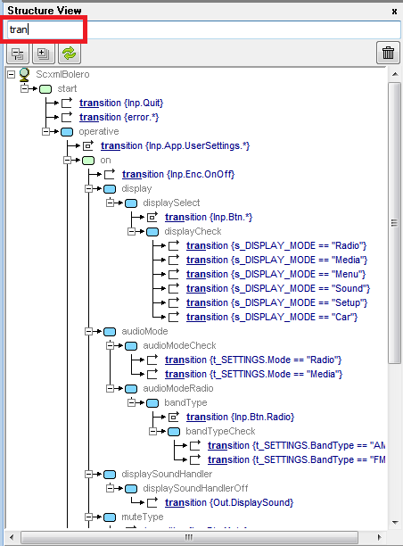

<a name="top-anchor"/>

| [Contents](#table-of-contents) | [SCXML Wiki](https://alexzhornyak.github.io/SCXML-tutorial/) | [SCXML Examples](https://alexzhornyak.github.io/SCXML-tutorial/Examples/) | [Forum](https://github.com/alexzhornyak/ScxmlEditor-Tutorial/discussions) |
|---|---|---|---|


**[Video overview - v.1.0](https://youtu.be/tL-NICRwggY)**

**[Video overview - v.2.0](https://youtu.be/SryLDwxcCjA)**

**[Video overview - v.2.1](https://youtu.be/h2CXPBAK_XY)**

**[Video overview - v.2.2](https://youtu.be/30dyXAs-m1A)**

# Scxml Editor 2.5.1
Powerful tool for creating, editing and debugging SCXML charts.


**New:** [IDE Insight](#new-ide-insight), [DOT-based autolayout](Doc/DotBasedAutoLayout.md#dot-based-auto-layout), [SCXML to DOT](Doc/DotBasedAutoLayout.md#how-to-convert-scxml-to-dot), [Inheritance](Doc/Inheritance.md), [visual chart splitting](Doc/VisualStateChartSplitting.md), [conditional project definitions](Doc/ConditionalDefines.md), GIF maker etc.

## Quick Support
[](https://discord.gg/5XWDsbEXzn)

### Changelog
**2.5.1:** Fast Triggers <br>
**2.5:** [Virtual Invoke](Doc/VisualStateChartSplitting.md#virtual-invoke) <br>
**2.4:** [Post Save Commands](Doc/ProjectTree.md#post-save-unit-actions), [Self-Transitions Inside](Doc/Transitions.md#self-transitions-inside-states) <br>
**2.3:** Highlight Transitions <br>
**2.2.4:** [Import QtCreator state charts](Doc/ImportStateCharts.md) <br>
**2.2.3:** [Transition indexes bugfix](https://github.com/alexzhornyak/ScxmlEditor-Tutorial/issues/66) <br>
**2.2.2:** [Option to override SmartTransitions](Doc/SmartSwitchTransitions.md#option-to-override-inverted-condition-since-scxmleditor-222) <br>
**2.2.1:** [Qt SVG Monitors Released](https://github.com/alexzhornyak/QtScxmlMonitor/blob/main/README.md) <br>
**2.2:** [Invoke ID is sending by testing apps](Doc/DebugScxmlStateCharts.md#how-to-debug-multiple-invoked-state-machines) <br>
**2.1.10:** [New breakpoints interface](Doc/DebugScxmlStateCharts.md#breakpoints) <br>
**2.1.9:** [Better handling of virtual states](Doc/VisualStateChartSplitting.md#adding-onentry-onexit-datamodel-and-invoke-to-virtual-states) <br>
**2.1.8:** [Support of custom console testing applications](Doc/DebugScxmlStateCharts.md#custom-testing-application-setup) like [SCION command-line tool](https://gitlab.com/scion-scxml/cli) <br>
**2.1.7:** [SVG Export Settings](Doc/ExportScxmlToSVG.md#svg-export-settings) <br>
**2.1.6:** UScxmlTester with EcmaScript, In() predicate autocomplete, QtScxmlTester 5.9.1->5.15 <br>
**2.1.5:** [Refactored Qt external debugger](https://github.com/alexzhornyak/QtScxmlMonitor/blob/main/README.md#qt-scxml-external-debugging-monitor) <br>
**2.1.4:** [Export SCXML to SVG](Doc/ExportScxmlToSVG.md), [Structure View](Doc/ScxmlStructureView.md)

## System requirements
- **Windows** 7, 8, 10, 11 (MSVC 2010, MSVC 2015 Update 3 Runtimes installed)
- **Linux** via [Wine](https://www.winehq.org/)
- **Mac OS** via [Wine](https://www.winehq.org/) and [Wineskin](https://github.com/Gcenx/WineskinServer)
> **NOTICE! Dot '.' must be a float-point delimiter in OS Regional Settings !!!**

## Installation
You can find portable version as attached Zip in ScxmlEditor Github Release page

Latest version: **[2.5.1.1749]**

### Windows Installation
#### First Install
1. Download from latest Release page and unpack it in any target location
2. Install **ScxmlEditor\vcredist_x86.exe** for **UscxmlTester**, **Graphviz**
3. Install  **ScxmlEditor\vcredist_x64.exe** for **QtScxmlTester** <br>
(_You may skip steps 2 and 3 if you have previously installed MSVC 2015 Update 3 redistributable_)
4. Install **ScxmlEditor\UScxmlTester\vcredist_x86_vc10.exe** for **UscxmlTester** with **EcmaScript** datamodel <br>
(_You may skip step 4 if you have previously installed MSVC 2010 redistributable_)

#### Update
1. Download from latest Release page and unpack it into **Temporary** folder
2. Run **Temporary\ScxmlEditor\ScxmlEditor_InstallOrUpdate.cmd "Path\To\Location\ScxmlEditor"**

> NOTICE! We are continiously making updates, so follow the version number on the README page and update to the latest to have all last cool features

### [Linux Installation](Doc/LinuxInstallation.md)
1. **Install [Wine](https://www.winehq.org/):**
```batch
sudo apt -y install wine
```
2. **Install Microsoft fonts**
- Install a collection of Microsoft fonts.
```batch
sudo apt install ttf-mscorefonts-installer
```
- Acknowledge the terms of the EULA in your terminal when prompted.
3. Download ScxmlEditor from latest Release page and unpack it in any target location 
4. Run program
```batch
cd /path/to/ScxmlEditor
wine ScxmlEditor.exe
```

### [MacOS Installation](Doc/MacOSInstallation.md)
Read detailed installation steps [here](Doc/MacOSInstallation.md)

---


## Roadmap
- [ ] Make Open API (Lua based)
- [ ] Make cross-platform
- [x] Make opensource

## Donations
If you are interested in the development of ScxmlEditor we would be highly appreciated for any help.

| Paypal |
| ------ |
| [](https://www.paypal.com/donate/?hosted_button_id=6W4NBU7TEF27W) |

## Licensing
ScxmlEditor source code is distributed under under the terms of the BSD 3-Clause License but if you want to compile binary application by yourself you need to purchase external components with their own licensies by yourself.

Current binaries are compiled with single development licensies registered by this github account owner name.
**Many thanks to all who made donations and especially to [Ed K]() for his valuable contribution**

| External Components | License | Comment |
|---------|---------|---------|
| [TeeChart Pro](https://www.steema.com/feature_matrix/vcl) | [Steema Software Licenses](https://www.steema.com/licensing/vcl) | State chart editor is based on TTree |
| [LMD VCL Complete](https://www.lmdinnovative.com/products/vcl/lmdvcl) | [LMD Innovative License](https://curl.haxx.se/docs/copyright.html) | Used in Dock Panels, Property inspector, etc. |
| [VCL Components](https://xerces.apache.org/xerces-c/) | [C++Builder Community Edition](https://www.embarcadero.com/products/cbuilder/starter) | General application compilation and VCL standard components |
| [log4cpp](https://github.com/orocos-toolchain/log4cpp) | [LGPL-2.1 license](https://github.com/orocos-toolchain/log4cpp/blob/master/COPYING) | Logger |
| [myJSON](https://github.com/badunius/myJSON) | [MIT License](https://github.com/badunius/myJSON/blob/master/LICENSE) | JSON Parsing |
| [PNG Functions](https://github.com/TurboPack/PNGComponents) | [Mozilla Public License 1.1](https://github.com/TurboPack/PNGComponents/blob/master/license.txt) | PNG Functions |


## Table of contents
- Common
  - [IDE Insight](Doc/IDEInsight.md)
  - Main menu
  - Main toolbar
  - [Project tree](Doc/ProjectTree.md)
    - [Post Save Unit](Doc/ProjectTree.md#post-save-unit-actions)
  - [Property inspector](Doc/PropertyInspector.md)
  - [SCXML source code view and live editing](Doc/LiveScxmlEdit.md)
- Projects
  - [Building a Project](Doc/ProjectBuild.md)
  - [Visual State Chart Splitting](Doc/VisualStateChartSplitting.md)
    - [Virtual Invoke](Doc/VisualStateChartSplitting.md#virtual-invoke)
  - [Conditional Project Definitions](Doc/ConditionalDefines.md)
- State chart
  - Interface
    - [SCXML Structure View](Doc/ScxmlStructureView.md)
    - Side toolbar
    - Tool (bookmarks) panel
    - Shapes panel
    - [Chart design panel](Doc/ChartDesignPanel.md)
  - States and children (Shapes)
  - [Transitions (Connections)](Doc/Transitions.md)
    - [Self-Transitions](Doc/Transitions.md#self-transitions-connections)
    - [Smart Switch Transitions](Doc/SmartSwitchTransitions.md)
  - [Inheritance](Doc/Inheritance.md)
  - [DOT-based autolayout](Doc/DotBasedAutoLayout.md#dot-based-auto-layout)
- [Imports](Doc/ImportStateCharts.md)
  - [Import from QtCreator state charts](Doc/ImportStateCharts.md)
  - [Import from ScxmlGui (by fmorbini) state charts](Doc/ImportStateCharts.md#import-from-scxmlgui-by-fmorbini-state-charts)
- Exports
  - [Convert SCXML to DOT](Doc/DotBasedAutoLayout.md#how-to-convert-scxml-to-dot)
  - [Export SCXML to SVG](Doc/ExportScxmlToSVG.md)
- Run and Debug
  - [How to debug SCXML statecharts](Doc/DebugScxmlStateCharts.md)
  - [Qt SCXML framework debugging](https://github.com/alexzhornyak/QtScxmlMonitor/blob/main/README.md)
    - [Qt SCXML Monitors (UDP, SVG)](https://github.com/alexzhornyak/QtScxmlMonitor/blob/main/README.md)    

## Creating SCXML charts

### Creating a unit
**Unit** is a single scxml chart. It is mostly used for simple charts without invokable sessions.

Select **File**->**New Unit** or press **Shift+Ctrl+N**


### Creating a project
**Project** is the most preferred choice of designing scxml charts to get all benefits (custom triggers, nested scxml charts, etc.)

Select **File**->**New Project** or press **Ctrl+N**


## Editing SCXML charts
**ScxmlEditor** provides a project wizard for opening scxml. It supports either opening files with metainformation about the position of states and transitions or plain scxml files. You can use **ScxmlEditor** to add states and transitions to the chart. You can add executable content to a state chart to enable the state machine to modify its data model and to interact with external entities.

1. Select **File**->**Open Unit** or press **Shift+Ctrl+O** (for all types of .scxml files)
2. Select **File**->**Open Project** or press **Ctrl+O** (for ScxmlEditor .sproj files)

### [Property inspector](Doc/PropertyInspector.md)
Is used to edit and examine the properties of the currently selected states, executable contents and transitions.


### Editor tabs
Are used to add scxml elements, zoom, align, change chart visual options, etc.


### NEW! [IDE Insight](Doc/IDEInsight.md)
Press **'Ctrl+.'** to call **IDE Insight dialog** where you may search for all actions through the application. Add shapes, edit properties in one place!


### Structure View with quick search


## [Debugging](Doc/DebugScxmlStateCharts.md)
**ScxmlEditor** has an ability to receive and send string UDP commands: <br>
### Receive API:
- `@@@` - clear highlighted states in all statecharts
- `@@@ScxmlName` - clear highlighted states in statechart where [\<scxml\>](https://alexzhornyak.github.io/SCXML-tutorial/Doc/scxml.html) 'name' is equal `ScxmlName` 
- `Type@ScxmlName@Msg@Id` - commands to highlight state or display message in **CallStack** panel <br>
**Description:**
  `Type` - integer type of command: `1 - AfterEnter, 2 - BeforeEnter, 3 - AfterExit, 4 - BeforeExit, 5 - Step, 6 - BeforeExecContent, 7 - AfterExecContent, 8 - BeforeInvoke, 9 - AfterInvoke, 10 - BeforeUnInvoke, 11 - AfterUnInvoke, 12 - BeforeTakingTransition, 13 - AfterTakingTransition, 14 - StableConfiguration, 15 - BeforeProcessingEvent` <br>
  `ScxmlName` - name of [\<scxml\>](https://alexzhornyak.github.io/SCXML-tutorial/Doc/scxml.html) <br>
  `Msg` - message which depends on type of command. For example: for **BeforeEnter** or **BeforeExit** - it is the id(name) of states, for **BeforeInvoke** or **BeforeUnInvoke** it is the name of invoked element, etc. </br>
  `Id` - [identifier of the invoked](https://alexzhornyak.github.io/SCXML-tutorial/Doc/invoke.html#id) state machine (Since ScxmlEditor 2.2). Can be empty for root machines
> **BeforeEnter** graphically highlight and **BeforeExit** unhighlight the corresponding states, other commands are displayed in **CallStack** panel

> Since **ScxmlEditor 2.3** there is an option to highlight taking transitions in **BeforeTakingTransition**
> Message format: `FromState|TransitionIndex` where `TransitionIndex` is transition xml child index

#### Example of commands:
- `2@CalculatorStateMachine@operand1` - highlight state `operand1` in statechart **CalculatorStateMachine** <br>
- `4@CalculatorStateMachine@operand1` - unhighlight state `operand1` in statechart **CalculatorStateMachine** <br>
- `2@ScxmlSub1@isSub1@ID_SUB_1` - highlight state `isSub1` in statechart **ScxmlSub1** when [invoke Id](Doc/DebugScxmlStateCharts.md#how-to-debug-multiple-invoked-state-machines) is `ID_SUB_1` <br>
- `12@CalculatorStateMachine@operand1|0` - highlight the first transition from **operand1** state in statechart **CalculatorStateMachine** <br>

You can also [trace the execution of the chart](Doc/DebugScxmlStateCharts.md#trace-mode) and use [breakpoints](Doc/DebugScxmlStateCharts.md#breakpoints).

### Local debugging
ScxmlEditor starts a testing application, intercepts its command line output and may communicate in two modes:
- [**UDP mode**](Doc/DebugScxmlStateCharts.md#receive-api) (receives UDP commands and sends events as UDP packages to testing application)
- [**Pipes mode (since version 2.1.8)**](Doc/DebugScxmlStateCharts.md#custom-testing-application-setup) (capture enter-exit events from console output by regexp, and submit trigger event to state machine to console input)

There are two ready-to-use testing applications:

1. Based on [USCXML framework](https://github.com/tklab-tud/uscxml).
Supports **null, lua, ecmascript** datamodels

2. [QtScxmlTester](Testers/QtScxmlTester/README.md) - based on [Qt SCXML framework](https://doc.qt.io/qt-5/qtscxml-overview.html)
Supports **null, ecmascript** datamodels

Also you may write your own testing application using the corresponding API

### External debugging
In this mode ScxmlEditor only listens UDP commands for highlighting states and displaying messages in CallStack panel

### Breakpoints


## [Qt SCXML framework debugging](https://github.com/alexzhornyak/QtScxmlMonitor/blob/main/README.md)

### NEW! [Qt SCXML Debug Via SVG](https://github.com/alexzhornyak/QtScxmlMonitor/blob/main/README.md)
It was an old dream to monitor state machine workflow without any external dependencies in Qt and finally it comes true. </b>
We prepared some native SCXML SVG monitors:
- [scxmlsvgview.h](Include/scxmlsvgview.h) - for widgets (based on QGraphicsView)
    - see how to use it in [Dining Philosophers Example](https://github.com/alexzhornyak/SCXML-tutorial/tree/master/Examples/Qt/DiningPhilosophers)
- [scxmlsvgqmlitem.h](Include/scxmlsvgqmlitem.h) - for QML (based on QQuickPaintedItem)
    - see how to use it in [Stopwatch Example](https://github.com/alexzhornyak/SCXML-tutorial/tree/master/Examples/Qt/StopWatch)


Since ScxmlEditor 2.2.1 you can export SCXML to SVG, include only monitor headers in your app and create monitor instances any time. 
> **NOTICE:** While state machine pointer is not set, the monitor **does nothing** and can be left in **Release**.

### Qt SCXML External Debugging with ScxmlEditor
For Qt SCXML applications you may include [scxmlexternmonitor2.h](Include/scxmlexternmonitor2.h) header to your project and follow [the instructions](https://github.com/alexzhornyak/QtScxmlMonitor/blob/main/README.md)

#### Example of debugging Qt Calculator-QML project


1. Select **Run**->**Start listening from external application**
2. Select **Run**->**Run**
3. Launch **Calculator-QML.exe**
4. Use **Pause** for tracing (optionally)


| [TOP](#top-anchor) | [Contents](#table-of-contents) | [SCXML Wiki](https://alexzhornyak.github.io/SCXML-tutorial/) | [SCXML Examples](https://alexzhornyak.github.io/SCXML-tutorial/Examples/) | [Forum](https://github.com/alexzhornyak/ScxmlEditor-Tutorial/discussions) |
|---|---|---|---|---|
